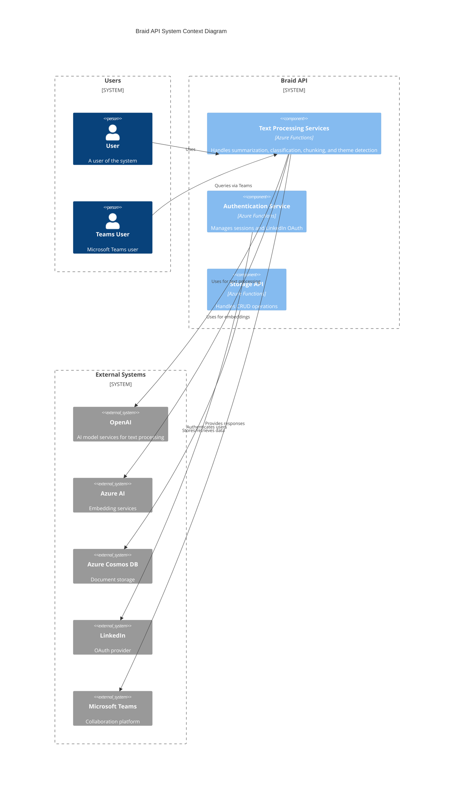

```mermaid
C4Context
title Braid API System Context Diagram

System_Boundary(users, "Users") {
    Person(user, "User", "A user of the system")
    Person(teamsUser, "Teams User", "Microsoft Teams user")
}

System_Boundary(braidApi, "Braid API") {
    Component(textProcessing, "Text Processing Services", "Azure Functions", "Handles summarization, classification, chunking, and theme detection")
    Component(authService, "Authentication Service", "Azure Functions", "Manages sessions and LinkedIn OAuth")
    Component(storageApi, "Storage API", "Azure Functions", "Handles CRUD operations")
}

System_Boundary(external_systems, "External Systems") {
    System_Ext(openai, "OpenAI", "AI model services for text processing")
    System_Ext(azureAI, "Azure AI", "Embedding services")
    System_Ext(cosmosDB, "Azure Cosmos DB", "Document storage")
    System_Ext(linkedin, "LinkedIn", "OAuth provider")
    System_Ext(teams, "Microsoft Teams", "Collaboration platform")
}

Rel(user, textProcessing, "Uses")
Rel(teamsUser, textProcessing, "Queries via Teams")
Rel(textProcessing, openai, "Uses for text processing")
Rel(textProcessing, azureAI, "Uses for embeddings")
Rel(storageApi, cosmosDB, "Stores/retrieves data")
Rel(authService, linkedin, "Authenticates users")
Rel(textProcessing, teams, "Provides responses")


```