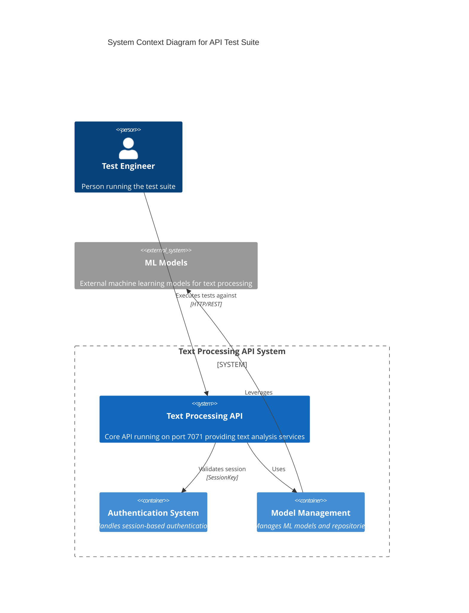

```mermaid
C4Context
title System Context Diagram for API Test Suite

Person(tester, "Test Engineer", "Person running the test suite")

System_Boundary(api_system, "Text Processing API System") {
    System(text_api, "Text Processing API", "Core API running on port 7071 providing text analysis services")
    
    Container(auth_system, "Authentication System", "Handles session-based authentication")
    
    Container(model_system, "Model Management", "Manages ML models and repositories")
}

System_Ext(ml_models, "ML Models", "External machine learning models for text processing")

Rel(tester, text_api, "Executes tests against", "HTTP/REST")
Rel(text_api, auth_system, "Validates session", "SessionKey")
Rel(text_api, model_system, "Uses")
Rel(model_system, ml_models, "Leverages")

UpdateLayoutConfig($c4ShapeInRow="3", $c4BoundaryInRow="1")
```