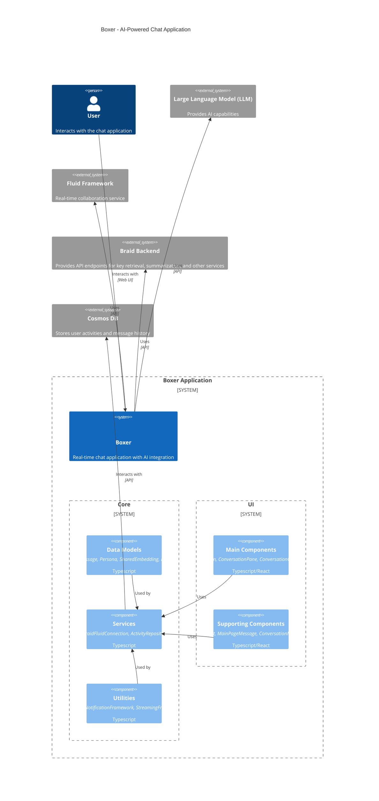

```mermaid
C4Context
title Boxer - AI-Powered Chat Application

Person(user, "User", "Interacts with the chat application")

System_Boundary(c1, "Boxer Application") {
  System(boxer, "Boxer", "Real-time chat application with AI integration", "Typescript/React, Fluid Framework")
  
  System_Boundary(c2, "Core") {
    Component(data_models, "Data Models", "Message, Persona, SharedEmbedding, Like", "Typescript")
    Component(services, "Services", "AIConnection, BraidFluidConnection, ActivityRepository, KeyRetriever", "Typescript")
    Component(utilities, "Utilities", "CaucusFramework, NotificationFramework, StreamingFramework, Debounce", "Typescript")
  }
  
  System_Boundary(c3, "UI") {
    Component(main_components, "Main Components", "AnimatedIconButton, ConversationPane, ConversationController, JoinPane", "Typescript/React")
    Component(supporting_components, "Supporting Components", "MessagePrompt, MainPageMessage, ConversationMessagePrompt", "Typescript/React")
  }
}

System_Ext(llm, "Large Language Model (LLM)", "Provides AI capabilities")
System_Ext(fluid, "Fluid Framework", "Real-time collaboration service")
System_Ext(braid, "Braid Backend", "Provides API endpoints for key retrieval, summarization, and other services")
System_Ext(cosmosdb, "Cosmos DB", "Stores user activities and message history")


Rel(user, boxer, "Interacts with", "Web UI")
Rel(boxer, llm, "Uses", "API")
Rel(boxer, fluid, "Uses", "API")
Rel(boxer, braid, "Uses", "API")
Rel(services, cosmosdb, "Interacts with", "API")
Rel(data_models, services, "Used by")
Rel(utilities, services, "Used by")
Rel(main_components, services, "Uses")
Rel(supporting_components, services, "Uses")

```
