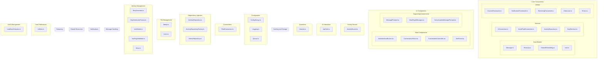

```mermaid
graph TD
subgraph Core Components
  subgraph Data Models
    Message.ts
    Persona.ts
    SharedEmbedding.ts
    Like.ts
  end
  subgraph Services
    AIConnection.ts
    BraidFluidConnection.ts
    ActivityRepository.ts
    KeyRetriever.ts
  end
  subgraph Utilities
    CaucusFramework.ts
    NotificationFramework.ts
    StreamingFramework.ts
    Debounce.ts
    Errors.ts
  end
end
subgraph UI Components
  subgraph Main Components
    AnimatedIconButton.tsx
    ConversationPane.tsx
    ConversationController.tsx
    JoinPane.tsx
  end
  subgraph Supporting Components
    MessagePrompt.tsx
    MainPageMessage.tsx
    ConversationMessagePrompt.tsx
  end
end
subgraph Activity Record
  ActivityRecord.ts
  ActivityRepository.ts
end
subgraph AI Interaction
  AIConnection.ts
  ApiCalls.ts
end
subgraph Assertions
  Asserts.ts
end
subgraph Caching and Storage
  CaucusFramework.ts
end
subgraph Configuration
  ConfigStrings.ts
  Errors.ts
  Logging.ts
  Queue.ts
end
subgraph Connections
  BraidFluidConnection.ts
  FluidConnection.ts
end
subgraph Dependency Injection
  IActivityRepository.ts
  IActivityRepositoryFactory.ts
  IAdminRepository.ts
end
subgraph File Management
  Media.ts
  Icons.ts
end
subgraph Identity Management
  IKeyGenerator.ts
  IKeyGeneratorFactory.ts
  JoinDetails.ts
  JoinPageValidator.ts
  KeyRetriever.ts
  Keys.ts
  Persona.ts
end
subgraph Message Handling
  Message.ts
end
subgraph Notifications
  NotificationFramework.ts
end
subgraph Shared Resources
  SharedEmbedding.ts
end
subgraph Streaming
  StreamingFramework.ts
end
subgraph User Preferences
  Utilities.ts
end
subgraph UUID Management
  UuidKeyGenerator.ts
end
```