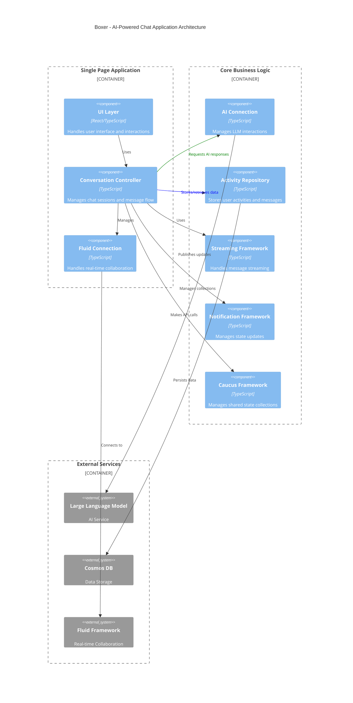

```mermaid
C4Component
    title Boxer - AI-Powered Chat Application Architecture

    Container_Boundary(spa, "Single Page Application") {
        Component(ui_layer, "UI Layer", "React/TypeScript", "Handles user interface and interactions")
        Component(conversation_controller, "Conversation Controller", "TypeScript", "Manages chat sessions and message flow")
        Component(fluid_connection, "Fluid Connection", "TypeScript", "Handles real-time collaboration")
    }

    Container_Boundary(core, "Core Business Logic") {
        Component(ai_connection, "AI Connection", "TypeScript", "Manages LLM interactions")
        Component(activity_repo, "Activity Repository", "TypeScript", "Stores user activities and messages")
        Component(streaming, "Streaming Framework", "TypeScript", "Handles message streaming")
        Component(notification, "Notification Framework", "TypeScript", "Manages state updates")
        Component(caucus, "Caucus Framework", "TypeScript", "Manages shared state collections")
    }

    Container_Boundary(external, "External Services") {
        System_Ext(llm, "Large Language Model", "AI Service")
        System_Ext(cosmos_db, "Cosmos DB", "Data Storage")
        System_Ext(fluid, "Fluid Framework", "Real-time Collaboration")
    }

    Rel(ui_layer, conversation_controller, "Uses")
    Rel(conversation_controller, fluid_connection, "Manages")
    Rel(fluid_connection, fluid, "Connects to")
    
    Rel(conversation_controller, ai_connection, "Requests AI responses")
    Rel(ai_connection, llm, "Makes API calls")
    
    Rel(conversation_controller, activity_repo, "Stores/retrieves data")
    Rel(activity_repo, cosmos_db, "Persists data")
    
    Rel(conversation_controller, streaming, "Uses")
    Rel(conversation_controller, notification, "Publishes updates")
    Rel(conversation_controller, caucus, "Manages collections")

    UpdateRelStyle(conversation_controller, ai_connection, $textColor="green", $lineColor="green")
    UpdateRelStyle(conversation_controller, activity_repo, $textColor="blue", $lineColor="blue")
```