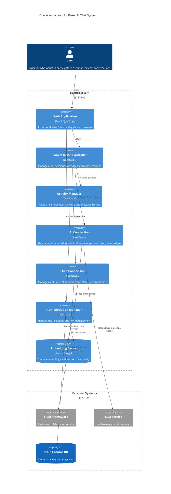

```mermaid
C4Container
    title Container diagram for Boxer AI Chat System

    Person(user, "User", "A person who wants to participate in AI-enhanced chat conversations")

    System_Boundary(boxer, "Boxer System") {
        Container(web_app, "Web Application", "React, TypeScript", "Provides all chat functionality via web browser")
        
        Container(conversation_controller, "Conversation Controller", "TypeScript", "Manages chat sessions, messages, and AI interactions")
        
        Container(activity_manager, "Activity Manager", "TypeScript", "Tracks and stores user activities and message history")
        
        Container(ai_connection, "AI Connection", "TypeScript", "Handles communication with LLM services and enriches conversations")
        
        Container(fluid_connection, "Fluid Connection", "TypeScript", "Manages real-time collaboration and state synchronization")
        
        Container(auth_manager, "Authentication Manager", "TypeScript", "Handles user sessions and key management")
        
        ContainerDb(embedding_cache, "Embedding Cache", "Local Storage", "Stores embeddings and session data locally")
    }

    System_Boundary(external, "External Systems") {
        System_Ext(fluid, "Fluid Framework", "Real-time collaboration service")
        System_Ext(llm, "LLM Service", "AI language model service")
        SystemDb(cosmos, "Braid Cosmos DB", "Stores activities and messages")
    }

    Rel(user, web_app, "Uses", "HTTPS")
    
    Rel(web_app, conversation_controller, "Uses")
    Rel(web_app, auth_manager, "Authenticates")
    
    Rel(conversation_controller, activity_manager, "Records activities")
    Rel(conversation_controller, ai_connection, "Requests AI responses")
    Rel(conversation_controller, fluid_connection, "Syncs state")
    
    Rel(activity_manager, cosmos, "Stores/retrieves data", "HTTPS")
    
    Rel(ai_connection, llm, "Requests completions", "HTTPS")
    Rel(ai_connection, embedding_cache, "Caches embeddings")
    
    Rel(fluid_connection, fluid, "Syncs real-time data", "WebSocket")
    
    Rel(auth_manager, embedding_cache, "Stores secrets")

    UpdateLayoutConfig($c4ShapeInRow="3", $c4BoundaryInRow="1")
```