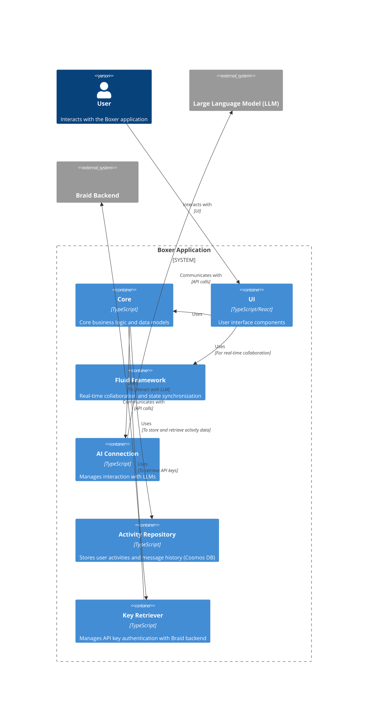

```mermaid
C4Context
  Person(user, "User", "Interacts with the Boxer application")

  System_Boundary(c1, "Boxer Application") {
    Container(core, "Core", "TypeScript", "Core business logic and data models")
    Container(ui, "UI", "TypeScript/React", "User interface components")
    Container(fluid_framework, "Fluid Framework", "", "Real-time collaboration and state synchronization")
    Container(ai_connection, "AI Connection", "TypeScript", "Manages interaction with LLMs")
    Container(activity_repository, "Activity Repository", "TypeScript", "Stores user activities and message history (Cosmos DB)")
    Container(key_retriever, "Key Retriever", "TypeScript", "Manages API key authentication with Braid backend")
  }

  System_Ext(llm, "Large Language Model (LLM)", "", "Provides AI capabilities")
  System_Ext(braid_backend, "Braid Backend", "", "Provides API for key retrieval, summarization, and other backend services")

  Rel(user, ui, "Interacts with", "UI")
  Rel(ui, core, "Uses", "")
  Rel(ui, fluid_framework, "Uses", "For real-time collaboration")
  Rel(core, ai_connection, "Uses", "To interact with LLM")
  Rel(core, activity_repository, "Uses", "To store and retrieve activity data")
  Rel(core, key_retriever, "Uses", "To retrieve API keys")
  Rel(ai_connection, llm, "Communicates with", "API calls")
  Rel(key_retriever, braid_backend, "Communicates with", "API calls")

```
