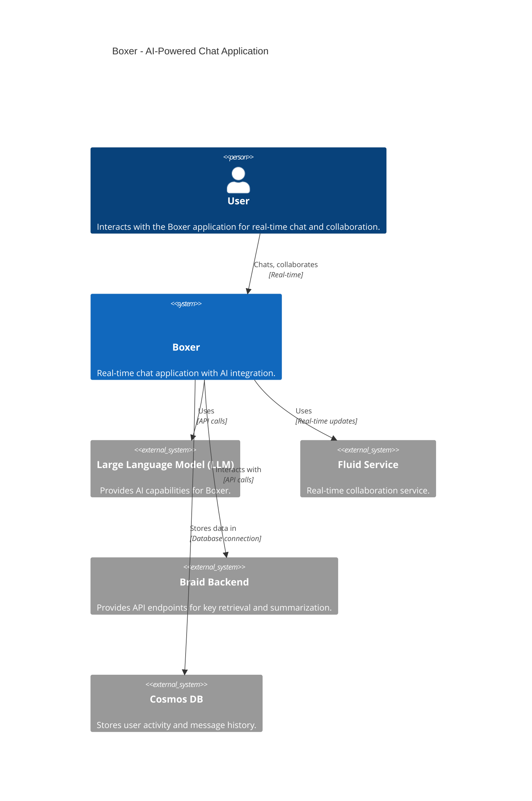

```mermaid
C4Context
title Boxer - AI-Powered Chat Application

Person(user, "User", "Interacts with the Boxer application for real-time chat and collaboration.")

System(boxer, "Boxer", "Real-time chat application with AI integration.", "TypeScript/React, Fluid Framework")

System_Ext(llm, "Large Language Model (LLM)", "Provides AI capabilities for Boxer.")
System_Ext(fluid_service, "Fluid Service", "Real-time collaboration service.")
System_Ext(braid_backend, "Braid Backend", "Provides API endpoints for key retrieval and summarization.")
System_Ext(cosmos_db, "Cosmos DB", "Stores user activity and message history.")

Rel(user, boxer, "Chats, collaborates", "Real-time")
Rel(boxer, llm, "Uses", "API calls")
Rel(boxer, fluid_service, "Uses", "Real-time updates")
Rel(boxer, braid_backend, "Interacts with", "API calls")
Rel(boxer, cosmos_db, "Stores data in", "Database connection")

```
