### Archie Diagram: Boxer - AI-Powered Chat Application Architecture

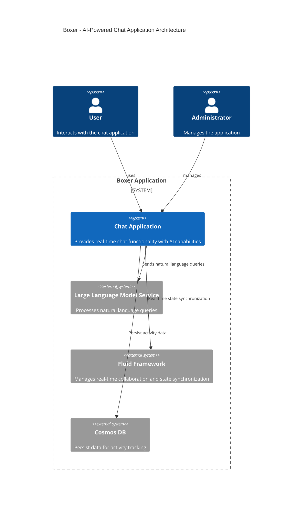

### Source Code Pipeline Diagrams

The following are detailed diagrams representing various components and their relationships within the Boxer codebase.

#### GitHub Data Flow

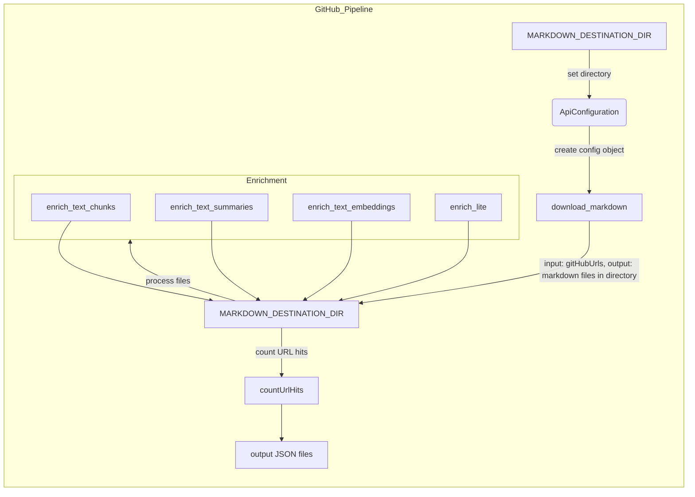

#### Make New Container Test

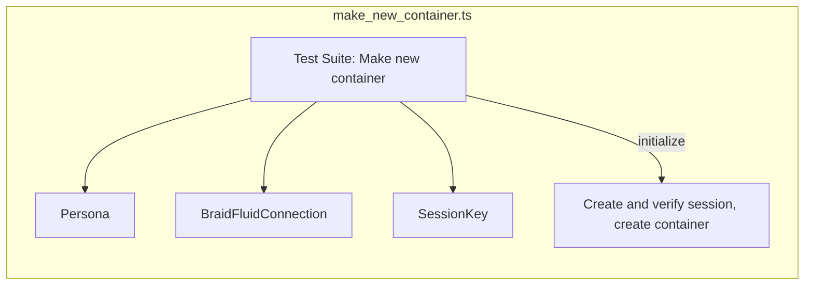

#### Web Pipeline

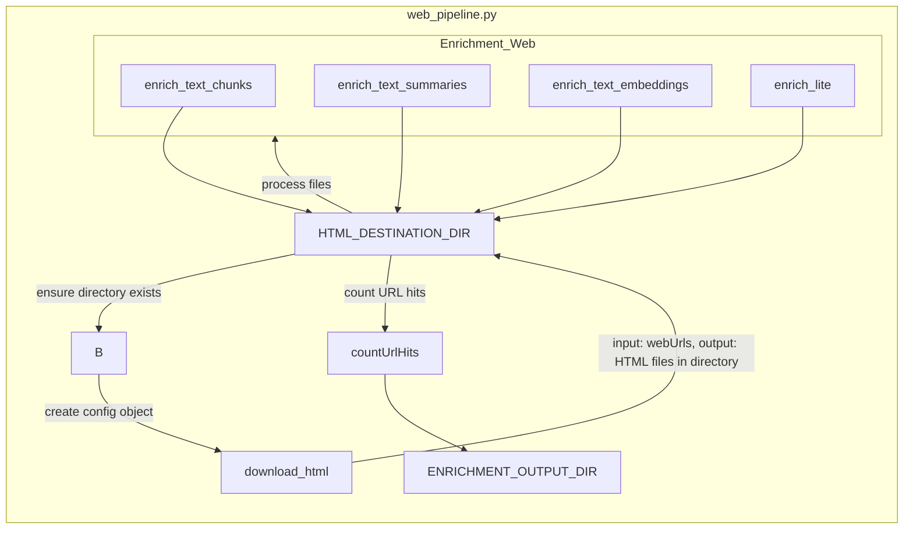

#### YouTube Pipeline

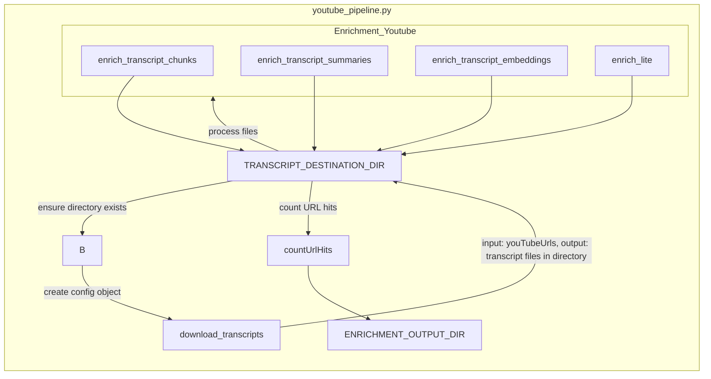

#### UI Component: AnimatedIconButton.tsx

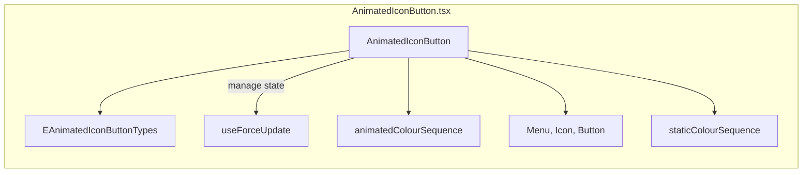

#### UI Component: AppEntry.tsx

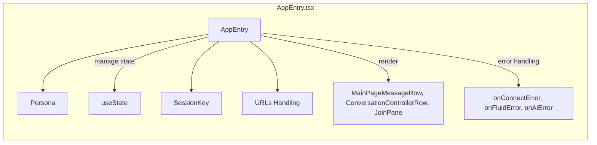

#### UI Component: ColumnStyles.tsx

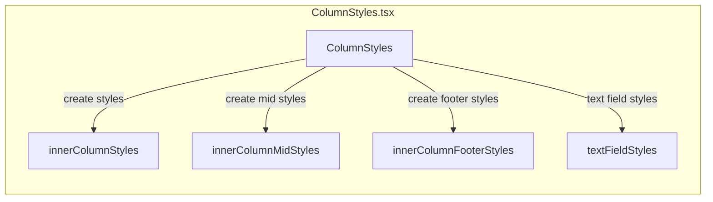

#### UI Component: ConversationController.tsx

```mermaid
graph TD

%% UI Component: ConversationController.tsx
subgraph ConversationController.tsx
    direction TB
    AZ[ConversationController]
    AZ --> BA[ConversationControllerRow]
    AZ -->|initialize| BB[initialiseConnectionState]
    AZ -->|manage state| BC[useState]

    subgraph User Actions
        BD[addMessage]
        BE[initialiseConnectionState]
        BF[onSend]
        BG[onCancelSuggestedContent]
        BH[onStreamedUpdate]
    end

    AZ --> User Actions
    User Actions --> BI[Update/Manage UI]
end
```

#### UI Component: ConversationMessagePrompt.tsx

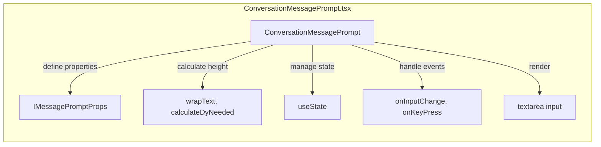

#### UI Component: ConversationPane.tsx

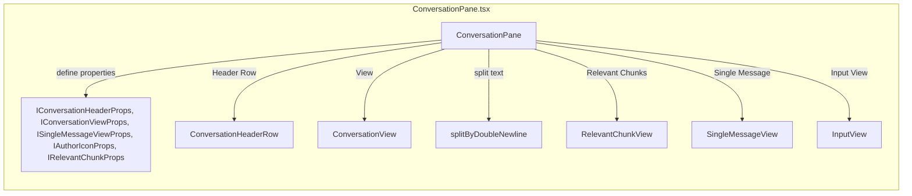

#### UI Component: JoinPane.tsx

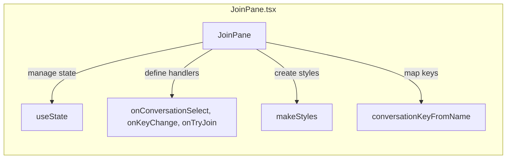

#### UI Component: MainPageMessage.tsx

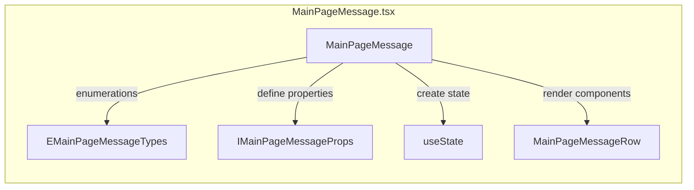

#### UIStrings Module

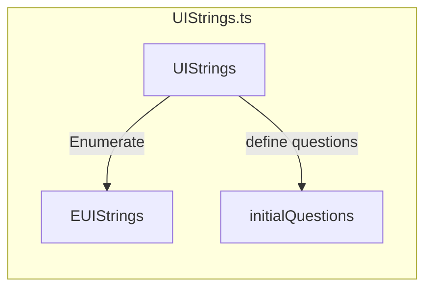

This extended set of diagrams should give any new developers a comprehensive understanding of the various components, pipelines, and their interactions within the Boxer AI-Powered Chat Application.

%% Generated by Salon from Braid Technologies, 09/03/2025
