```mermaid
flowchart TB
    subgraph User
        direction TB
        User(User)
    end

    subgraph Boxer["Boxer - AI-Powered Chat Application"]
        direction TB

        subgraph core["core/"]
            direction TB
            Message(Message.ts)
            Persona(Persona.ts)
            SharedEmbedding(SharedEmbedding.ts)
            Like(Like.ts)
            AIConnection(AIConnection.ts)
            BraidFluidConnection(BraidFluidConnection.ts)
            ActivityRepository(ActivityRepository.ts)
            KeyRetriever(KeyRetriever.ts)
            CaucusFramework(CaucusFramework.ts)
            NotificationFramework(NotificationFramework.ts)
            StreamingFramework(StreamingFramework.ts)
            Debounce(Debounce.ts)
        end

        subgraph ui["ui/"]
            direction TB
            AnimatedIconButton(AnimatedIconButton.tsx)
            ConversationPane(ConversationPane.tsx)
            ConversationController(ConversationController.tsx)
            JoinPane(JoinPane.tsx)
            subgraph SupportingComponents
                direction TB
                MessagePrompt(MessagePrompt.tsx)
                MainPageMessage(MainPageMessage.tsx)
                ConversationMessagePrompt(ConversationMessagePrompt.tsx)
            end
        end

        subgraph test["test/"]
        end
    end

    User --> ConversationPane
    ConversationPane --> ConversationController
    ConversationPane --> MessagePrompt
    ConversationPane --> MainPageMessage
    ConversationPane --> ConversationMessagePrompt

    ConversationController --> AIConnection
    ConversationController --> BraidFluidConnection
    ConversationController --> ActivityRepository
    ConversationController --> NotificationFramework
    ConversationController --> StreamingFramework
```

```mermaid
flowchart TB
  subgraph Python_Pipeline
    direction TB
    WebPipeline[web_pipeline.py]
    EnsureDirectory[ensure_directory_exists]
    DownloadHTML[download_html]
    EnrichTextChunks[enrich_text_chunks]
    EnrichTextSummaries[enrich_text_summaries]
    EnrichTextEmbeddings[enrich_text_embeddings]
    EnrichLite[enrich_lite]
    CountUrlHitsWeb[countUrlHits]
    ApiConfiguration[ApiConfiguration]

    WebPipeline --> EnsureDirectory
    WebPipeline --> DownloadHTML
    WebPipeline --> EnrichTextChunks
    WebPipeline --> EnrichTextSummaries
    WebPipeline --> EnrichTextEmbeddings
    WebPipeline --> EnrichLite
    WebPipeline --> CountUrlHitsWeb
    WebPipeline --> ApiConfiguration

    YoutubePipeline[youtube_pipeline.py]
    youTubeUrls[youTubeUrls]
    DownloadTranscripts[download_transcripts]
    EnrichTranscriptChunks[enrich_transcript_chunks]
    EnrichTranscriptSummaries[enrich_transcript_summaries]
    EnrichTranscriptEmbeddings[enrich_transcript_embeddings]
    CountUrlHitsYouTube[countUrlHits]

    YoutubePipeline --> EnsureDirectory
    YoutubePipeline --> youTubeUrls
    YoutubePipeline --> DownloadTranscripts
    YoutubePipeline --> EnrichTranscriptChunks
    YoutubePipeline --> EnrichTranscriptSummaries
    YoutubePipeline --> EnrichTranscriptEmbeddings
    YoutubePipeline --> EnrichLite
    YoutubePipeline --> CountUrlHitsYouTube
    YoutubePipeline --> ApiConfiguration
  end

  subgraph React_Components
    direction TB
    AppEntry[AppEntry.tsx]
    AnimatedIconButton[AnimatedIconButton.tsx]
    ColumnStyles[ColumnStyles.tsx]
    ConversationController[ConversationController.tsx]
    ConversationMessagePrompt[ConversationMessagePrompt.tsx]
    ConversationPane[ConversationPane.tsx]
    JoinPane[JoinPane.tsx]
    MainPageMessage[MainPageMessage.tsx]

    AppEntry -->|Uses| AnimatedIconButton
    AppEntry -->|Uses| ColumnStyles
    AppEntry -->|Uses| ConversationController
    AppEntry -->|Uses| JoinPane
    AppEntry -->|Uses| MainPageMessage

    ConversationController -->|Contains| ConversationMessagePrompt
    ConversationController -->|Contains| ConversationPane
    ConversationController -->|Uses| ColumnStyles

    AnimatedIconButton -->|Uses| ColumnStyles

    ConversationPane -->|Uses| ColumnStyles
    JoinPane -->|Uses| ColumnStyles
    MainPageMessage -->|Uses| ColumnStyles
  end

  subgraph Shared_Resources
    direction TB
    FluentUI[Fluent UI]
    UIStrings[UIStrings.ts]
  end

  Python_Pipeline --> Shared_Resources
  React_Components --> Shared_Resources

  style WebPipeline fill:#f9f,stroke:#333,stroke-width:2px
  style YoutubePipeline fill:#f9f,stroke:#333,stroke-width:2px
  style React_Components fill:#bbf,stroke:#333,stroke-width:2px
  style Shared_Resources fill:#bbc,stroke:#333,stroke-width:2px
```

