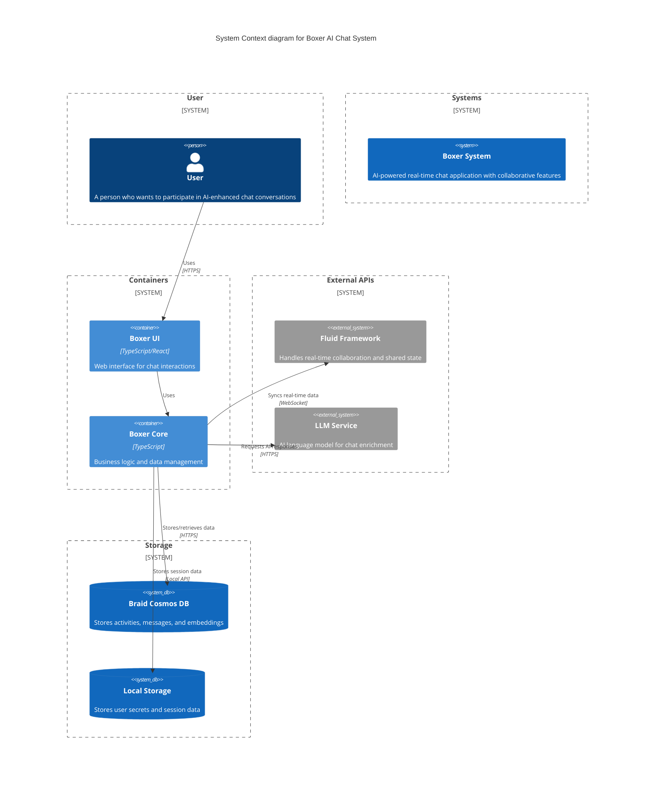

```mermaid
C4Context
    title System Context diagram for Boxer AI Chat System
    System_Boundary(s0, "User") {   
        Person(user, "User", "A person who wants to participate in AI-enhanced chat conversations")
    }
    System_Boundary(s1, "Systems") {
        System(boxer, "Boxer System", "AI-powered real-time chat application with collaborative features")
    }
    System_Boundary(s4, "Containers") {
        Container(ui, "Boxer UI", "TypeScript/React", "Web interface for chat interactions")
        Container(core, "Boxer Core", "TypeScript", "Business logic and data management")
    }
    System_Boundary(s2, "External APIs") {
        System_Ext(fluid, "Fluid Framework", "Handles real-time collaboration and shared state")
        System_Ext(llm, "LLM Service", "AI language model for chat enrichment")
    }
    System_Boundary(s3, "Storage") {
        SystemDb(cosmos, "Braid Cosmos DB", "Stores activities, messages, and embeddings")
        SystemDb(local_storage, "Local Storage", "Stores user secrets and session data")
    }

    
    Rel(user, ui, "Uses", "HTTPS")
    Rel(ui, core, "Uses")
    
    Rel(core, fluid, "Syncs real-time data", "WebSocket")
    Rel(core, llm, "Requests AI responses", "HTTPS")
    
    Rel(core, cosmos, "Stores/retrieves data", "HTTPS")
    Rel(core, local_storage, "Stores session data", "Local API")
    
```