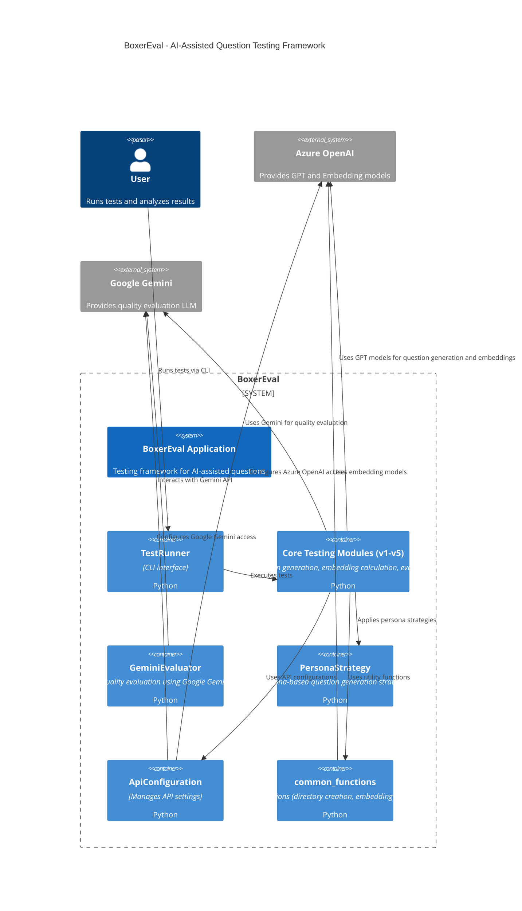

```mermaid
C4Context
title BoxerEval - AI-Assisted Question Testing Framework

Person(user, "User", "Runs tests and analyzes results")

System_Boundary(c1, "BoxerEval") {
  System(boxer_eval, "BoxerEval Application", "Testing framework for AI-assisted questions")

  Container(test_runner, "TestRunner", "CLI interface", "Python")
  Container(core_testing, "Core Testing Modules (v1-v5)", "Question generation, embedding calculation, evaluation", "Python")
  Container(gemini_evaluator, "GeminiEvaluator", "Quality evaluation using Google Gemini", "Python")
  Container(persona_strategy, "PersonaStrategy", "Persona-based question generation strategies", "Python")
  Container(api_configuration, "ApiConfiguration", "Manages API settings", "Python")
  Container(common_functions, "common_functions", "Utility functions (directory creation, embedding generation)", "Python")
}

System_Ext(azure_openai, "Azure OpenAI", "Provides GPT and Embedding models")
System_Ext(google_gemini, "Google Gemini", "Provides quality evaluation LLM")

Rel(user, test_runner, "Runs tests via CLI")
Rel(test_runner, core_testing, "Executes tests")
Rel(core_testing, azure_openai, "Uses GPT models for question generation and embeddings")
Rel(core_testing, google_gemini, "Uses Gemini for quality evaluation")
Rel(core_testing, persona_strategy, "Applies persona strategies")
Rel(core_testing, api_configuration, "Uses API configurations")
Rel(core_testing, common_functions, "Uses utility functions")
Rel(gemini_evaluator, google_gemini, "Interacts with Gemini API")
Rel(api_configuration, azure_openai, "Configures Azure OpenAI access")
Rel(api_configuration, google_gemini, "Configures Google Gemini access")
Rel(common_functions, azure_openai, "Uses embedding models")

```
