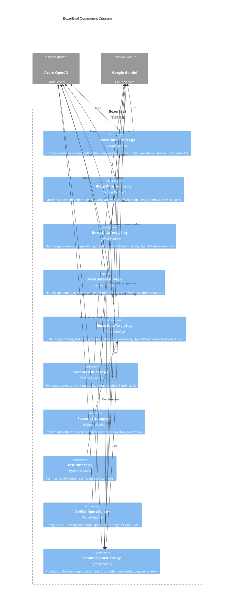

```mermaid
C4Component
title BoxerEval Component Diagram

System_Boundary(BoxerEval, "BoxerEval") {
    Component(BoxerDataTest_v1, "BoxerDataTest_v1.py", "Python Module", "Process questions via similarity embedding and generate enriched questions using Azure OpenAI API.")
    Component(BoxerDataTest_v2, "BoxerDataTest_v2.py", "Python Module", "Facilitates question generation, similarity analysis, and evaluation using OpenAI's Azure services.")
    Component(BoxerDataTest_v3, "BoxerDataTest_v3.py", "Python Module", "Handles persona-based question generation and evaluation using OpenAI's Azure services.")
    Component(BoxerDataTest_v4, "BoxerDataTest_v4.py", "Python Module", "Handles persona-based question generation, similarity embedding, and evaluation.")
    Component(BoxerDataTest_v5, "BoxerDataTest_v5.py", "Python Module", "Suite for generating and evaluating AI-related questions using OpenAI's API integrated with Azure.")
    Component(GeminiEvaluator, "GeminiEvaluator.py", "Python Module", "Evaluates generated content quality using Google's Gemini LLM.")
    Component(PersonaStrategy, "PersonaStrategy.py", "Python Module", "Implements different professional personas for question generation.")
    Component(TestRunner, "TestRunner.py", "Python Module", "CLI interface for running different test scenarios.")
    Component(ApiConfiguration, "ApiConfiguration.py", "Python Module", "Configures API settings for Azure OpenAI and Google's Gemini API.")
    Component(common_functions, "common_functions.py", "Python Module", "Provides utility functions such as directory creation and embedding generation.")
}

System_Ext(AzureOpenAI, "Azure OpenAI", "Cloud Service", "Provides GPT models and embedding services.")
System_Ext(GoogleGemini, "Google Gemini", "Cloud Service", "Provides evaluation mechanism using Gemini LLM.")

Rel(BoxerDataTest_v1, AzureOpenAI, "Uses")
Rel(BoxerDataTest_v1, GoogleGemini, "Uses")
Rel(BoxerDataTest_v2, AzureOpenAI, "Uses")
Rel(BoxerDataTest_v2, GoogleGemini, "Uses")
Rel(BoxerDataTest_v3, AzureOpenAI, "Uses")
Rel(BoxerDataTest_v3, GoogleGemini, "Uses")
Rel(BoxerDataTest_v4, AzureOpenAI, "Uses")
Rel(BoxerDataTest_v4, GoogleGemini, "Uses")
Rel(BoxerDataTest_v5, AzureOpenAI, "Uses")
Rel(BoxerDataTest_v5, GoogleGemini, "Uses")
Rel(GeminiEvaluator, GoogleGemini, "Evaluates content quality")
Rel(PersonaStrategy, BoxerDataTest_v1, "Uses different personas")
Rel(TestRunner, BoxerDataTest_v5, "Executes tests")
Rel(ApiConfiguration, AzureOpenAI, "Configures API settings")
Rel(ApiConfiguration, GoogleGemini, "Configures API settings")
Rel(common_functions, AzureOpenAI, "Generates embeddings")
Rel(BoxerDataTest_v1, common_functions, "Uses")
Rel(BoxerDataTest_v2, common_functions, "Uses")
Rel(BoxerDataTest_v3, common_functions, "Uses")
Rel(BoxerDataTest_v4, common_functions, "Uses")
Rel(BoxerDataTest_v5, common_functions, "Uses")
```

%% Generated by Salon from Braid Technologies, 09/03/2025
