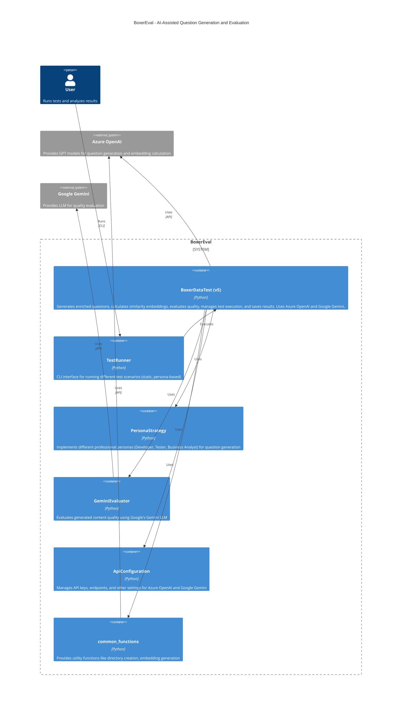

```mermaid
C4Context
title BoxerEval - AI-Assisted Question Generation and Evaluation

Person(user, "User", "Runs tests and analyzes results")

System_Boundary(c1, "BoxerEval") {
  Container(boxer_data_test, "BoxerDataTest (v5)", "Python", "Generates enriched questions, calculates similarity embeddings, evaluates quality, manages test execution, and saves results. Uses Azure OpenAI and Google Gemini.", "Python, Azure OpenAI SDK, Google Gemini SDK, tenacity, numpy")
  Container(test_runner, "TestRunner", "Python", "CLI interface for running different test scenarios (static, persona-based)", "Python")
  Container(persona_strategy, "PersonaStrategy", "Python", "Implements different professional personas (Developer, Tester, Business Analyst) for question generation", "Python")
  Container(gemini_evaluator, "GeminiEvaluator", "Python", "Evaluates generated content quality using Google's Gemini LLM", "Python, Google Gemini SDK")
  Container(api_configuration, "ApiConfiguration", "Python", "Manages API keys, endpoints, and other settings for Azure OpenAI and Google Gemini", "Python")
  Container(common_functions, "common_functions", "Python", "Provides utility functions like directory creation, embedding generation", "Python, Azure OpenAI SDK")
}

System_Ext(azure_openai, "Azure OpenAI", "Provides GPT models for question generation and embedding calculation")
System_Ext(google_gemini, "Google Gemini", "Provides LLM for quality evaluation")

Rel(user, test_runner, "Runs", "CLI")
Rel(test_runner, boxer_data_test, "Executes", "")
Rel(boxer_data_test, persona_strategy, "Uses", "")
Rel(boxer_data_test, gemini_evaluator, "Uses", "")
Rel(boxer_data_test, api_configuration, "Uses", "")
Rel(boxer_data_test, common_functions, "Uses", "")
Rel(boxer_data_test, azure_openai, "Uses", "API")
Rel(gemini_evaluator, google_gemini, "Uses", "API")
Rel(common_functions, azure_openai, "Uses", "API")

```
