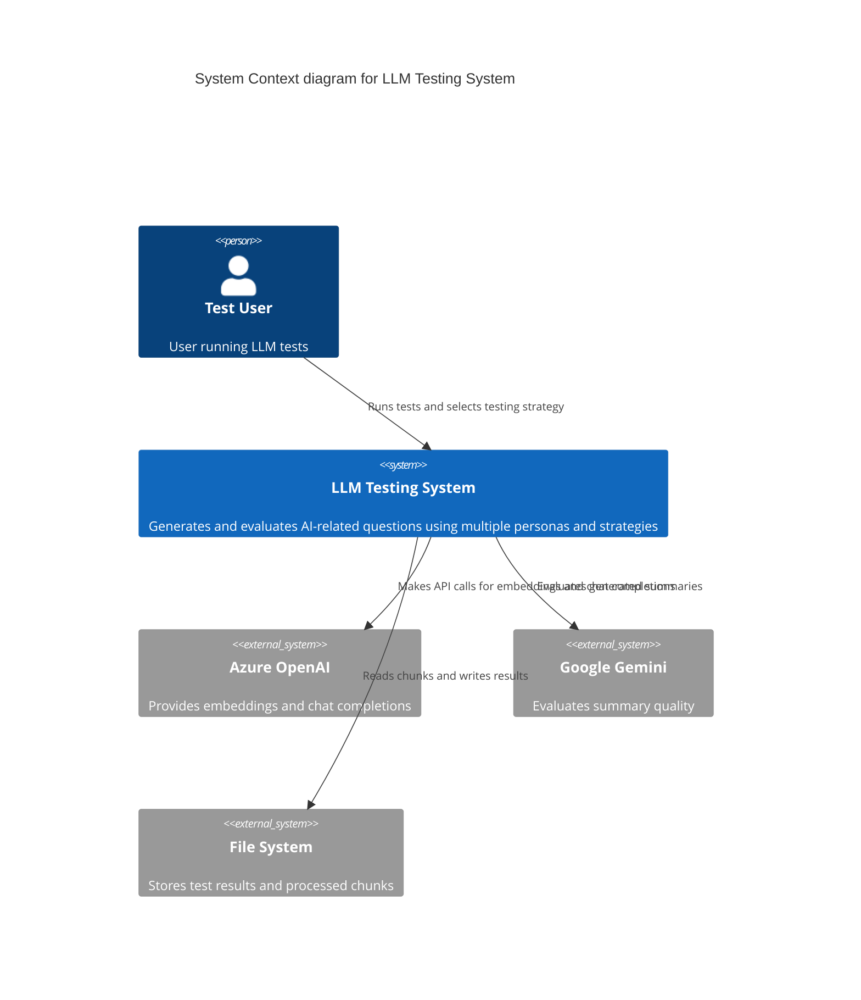

```mermaid
C4Context
    title System Context diagram for LLM Testing System

    Person(tester, "Test User", "User running LLM tests")
    
    System(testSystem, "LLM Testing System", "Generates and evaluates AI-related questions using multiple personas and strategies")
    
    System_Ext(azureOpenAI, "Azure OpenAI", "Provides embeddings and chat completions")
    System_Ext(gemini, "Google Gemini", "Evaluates summary quality")
    System_Ext(fileSystem, "File System", "Stores test results and processed chunks")

    Rel(tester, testSystem, "Runs tests and selects testing strategy")
    Rel(testSystem, azureOpenAI, "Makes API calls for embeddings and chat completions")
    Rel(testSystem, gemini, "Evaluates generated summaries")
    Rel(testSystem, fileSystem, "Reads chunks and writes results")

 
```