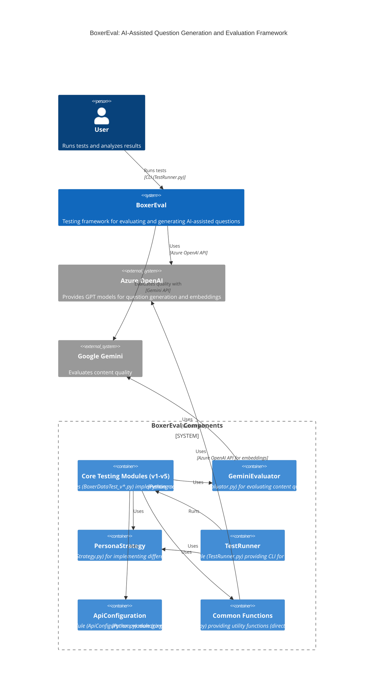

```mermaid
C4Context
title BoxerEval: AI-Assisted Question Generation and Evaluation Framework

Person(user, "User", "Runs tests and analyzes results")

System(boxereval, "BoxerEval", "Testing framework for evaluating and generating AI-assisted questions")

Rel(user, boxereval, "Runs tests", "CLI (TestRunner.py)")

System_Ext(azure_openai, "Azure OpenAI", "Provides GPT models for question generation and embeddings")

Rel(boxereval, azure_openai, "Uses", "Azure OpenAI API")

System_Ext(gemini, "Google Gemini", "Evaluates content quality")

Rel(boxereval, gemini, "Evaluates quality with", "Gemini API")


System_Boundary(c1, "BoxerEval Components") {
  Container(core_testing, "Core Testing Modules (v1-v5)", "Python modules (BoxerDataTest_v*.py) implementing core testing logic")
  Container(gemini_evaluator, "GeminiEvaluator", "Python module (GeminiEvaluator.py) for evaluating content quality using Google Gemini")
  Container(persona_strategy, "PersonaStrategy", "Python module (PersonaStrategy.py) for implementing different professional personas")
  Container(test_runner, "TestRunner", "Python module (TestRunner.py) providing CLI for running tests")
  Container(api_configuration, "ApiConfiguration", "Python module (ApiConfiguration.py) managing API settings")
  Container(common_functions, "Common Functions", "Python module (common_functions.py) providing utility functions (directory creation, embedding generation)")

  Rel(core_testing, gemini_evaluator, "Uses", "")
  Rel(core_testing, persona_strategy, "Uses", "")
  Rel(core_testing, api_configuration, "Uses", "")
  Rel(core_testing, common_functions, "Uses", "")
  Rel(test_runner, core_testing, "Runs", "")
  Rel(test_runner, persona_strategy, "Uses", "")
  Rel(gemini_evaluator, gemini, "Uses", "Gemini API")
  Rel(common_functions, azure_openai, "Uses", "Azure OpenAI API for embeddings")

}

```
