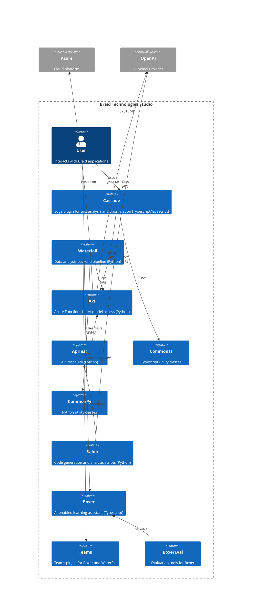

```mermaid
C4Context
  System_Boundary(c1, "Braid Technologies Studio") {
    Person(user, "User", "Interacts with Braid applications")

    System(cascade, "Cascade", "Edge plugin for text analysis and classification (Typescript/Javascript)")
    System(waterfall, "Waterfall", "Data analysis backend pipeline (Python)")
    System(api, "API", "Azure Functions for AI model access (Python)")
    System(apitest, "ApiTest", "API test suite (Python)")
    System(commonts, "CommonTs", "Typescript utility classes")
    System(commonpy, "CommonPy", "Python utility classes")
    System(salon, "Salon", "Code generation and analysis scripts (Python)")
    System(boxer, "Boxer", "AI-enabled learning assistant (Typescript)")
    System(teams, "Teams", "Teams plugin for Boxer and Waterfall")
    System(boxereval, "BoxerEval", "Evaluation tools for Boxer")

    Rel(user, cascade, "Uses", "Web UI")
    Rel(cascade, api, "Calls", "API")
    Rel(waterfall, api, "Calls", "API")
    Rel(apitest, api, "Tests", "")
    Rel(cascade, commonts, "Uses", "")
    Rel(waterfall, commonpy, "Uses", "")
    Rel(salon, apitest, "Generates", "")
    Rel(user, boxer, "Uses", "Web UI")
    Rel(user, teams, "Uses", "Teams Integration")
    Rel(boxereval, boxer, "Evaluates", "")

  }

  System_Ext(azure, "Azure", "Cloud platform")
  System_Ext(openai, "OpenAI", "AI Model Provider")


  Rel(api, azure, "Hosted on", "")
  Rel(api, openai, "Calls", "API")
  Rel(salon, openai, "Uses", "API")

```
