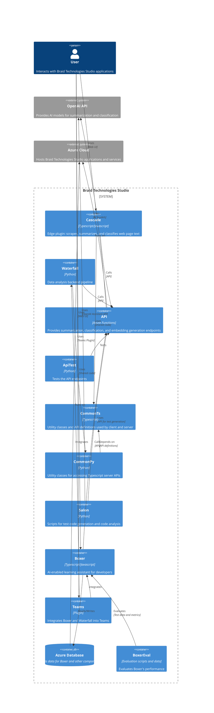

```mermaid
C4Context
  Person(user, "User", "Interacts with Braid Technologies Studio applications")

  System_Boundary(c1, "Braid Technologies Studio") {
    Container(cascade, "Cascade", "Typescript/Javascript", "Edge plugin: scrapes, summarizes, and classifies web page text")
    Container(waterfall, "Waterfall", "Python", "Data analysis backend pipeline")
    Container(api, "API", "Azure Functions", "Provides summarization, classification, and embedding generation endpoints")
    Container(apitest, "ApiTest", "Python", "Tests the API endpoints")
    Container(commonts, "CommonTs", "Typescript", "Utility classes and API definitions used by client and server")
    Container(commonpy, "CommonPy", "Python", "Utility classes for accessing Typescript server APIs")
    Container(salon, "Salon", "Python", "Scripts for test code generation and code analysis")
    Container(boxer, "Boxer", "Typescript/Javascript", "AI-enabled learning assistant for developers")
    Container(teams, "Teams", "Plugin", "Integrates Boxer and Waterfall into Teams")
    ContainerDb(database, "Azure Database", "Stores data for Boxer and other components")
    Container(boxereval, "BoxerEval", "Evaluation scripts and data", "Evaluates Boxer's performance")

  }

  System_Ext(openai, "OpenAI API", "Provides AI models for summarization and classification")
  System_Ext(azure, "Azure Cloud", "Hosts Braid Technologies Studio applications and services")


  Rel(user, cascade, "Uses", "Web UI")
  Rel(user, boxer, "Uses", "Web UI")
  Rel(user, teams, "Uses", "Teams Plugin")
  Rel(cascade, api, "Calls", "API")
  Rel(waterfall, api, "Calls", "API")
  Rel(apitest, api, "Tests", "")
  Rel(cascade, commonts, "Uses", "Shared code")
  Rel(waterfall, commonpy, "Uses", "Shared code")
  Rel(commonpy, commonts, "Depends on", "API definitions")
  Rel(salon, api, "Uses", "API for test generation")
  Rel(salon, openai, "Uses", "OpenAI Assistant API")
  Rel(boxer, api, "Calls", "API")
  Rel(boxer, database, "Reads/Writes", "")
  Rel(teams, boxer, "Integrates", "")
  Rel(teams, waterfall, "Integrates", "")
  Rel(api, openai, "Uses", "AI models")
  Rel(api, azure, "Runs on", "")
  Rel(database, azure, "Runs on", "")
  Rel(boxereval, boxer, "Evaluates", "Test data and metrics")

```
