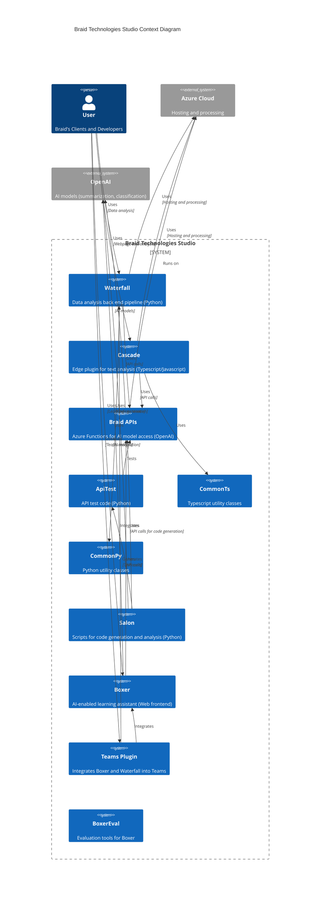

```mermaid
C4Context
title Braid Technologies Studio Context Diagram

Person(user, "User", "Braid's Clients and Developers")

System_Boundary(c1, "Braid Technologies Studio") {
  System(waterfall, "Waterfall", "Data analysis back end pipeline (Python)")
  System(cascade, "Cascade", "Edge plugin for text analysis (Typescript/Javascript)")
  System(apis, "Braid APIs", "Azure Functions for AI model access (OpenAI)")
  System(apitest, "ApiTest", "API test code (Python)")
  System(commonts, "CommonTs", "Typescript utility classes")
  System(commonpy, "CommonPy", "Python utility classes")
  System(salon, "Salon", "Scripts for code generation and analysis (Python)")
  System(boxer, "Boxer", "AI-enabled learning assistant (Web frontend)")
  System(teams, "Teams Plugin", "Integrates Boxer and Waterfall into Teams")
  System(boxereval, "BoxerEval", "Evaluation tools for Boxer")

  Rel(cascade, apis, "Uses", "API calls")
  Rel(waterfall, apis, "Uses", "API calls")
  Rel(boxer, apis, "Uses", "API calls")
  Rel(salon, apis, "Uses", "API calls for code generation")
  Rel(apitest, apis, "Tests", "")
  Rel(salon, apitest, "Generates", "Test code")
  Rel(cascade, commonts, "Uses", "")
  Rel(waterfall, commonpy, "Uses", "")
  Rel(teams, boxer, "Integrates", "")
  Rel(teams, waterfall, "Integrates", "")
}

System_Ext(azure, "Azure Cloud", "Hosting and processing")
System_Ext(openai, "OpenAI", "AI models (summarization, classification)")


Rel(user, cascade, "Uses", "Webpage text analysis")
Rel(user, waterfall, "Uses", "Data analysis")
Rel(user, boxer, "Uses", "Learning assistance")
Rel(user, teams, "Uses", "Teams integration")
Rel(waterfall, azure, "Uses", "Hosting and processing")
Rel(cascade, azure, "Uses", "Hosting and processing")
Rel(apis, azure, "Runs on", "")
Rel(apis, openai, "Uses", "AI models")
Rel(salon, openai, "Uses", "Code generation")
Rel(boxer, openai, "Uses", "AI models")
```