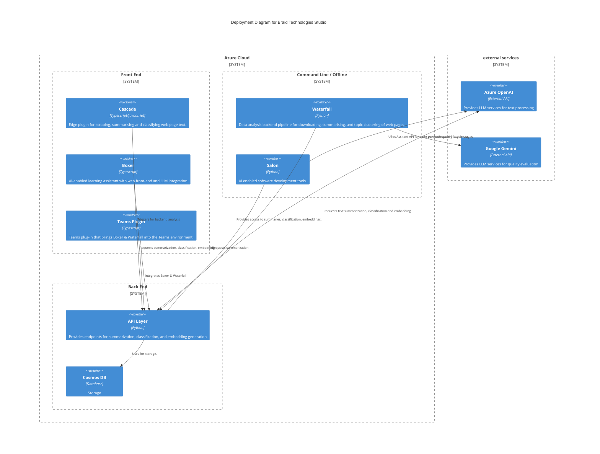

```mermaid
C4Deployment
    title Deployment Diagram for Braid Technologies Studio

    System_Boundary(c1, "Azure Cloud") {

    System_Boundary(c2, "Front End") {
        Container(cascade_container, "Cascade", "Typescript/Javascript", "Edge plugin for scraping, summarising and classifying web page text.")
        Container(boxer_container, "Boxer", "Typescript", "AI-enabled learning assistant with web front-end and LLM integration")     
        Container(teams_plugin, "Teams Plugin", "Typescript", "Teams plug-in that brings Boxer & Waterfall into the Teams environment.")          
    }

    System_Boundary(c3, "Command Line / Offline") {
        Container(waterfall_container, "Waterfall", "Python", "Data analysis backend pipeline for downloading, summarising, and topic clustering of web pages.")
        Container(salon_container, "Salon", "Python", "AI enabled software development tools.")
    }

    System_Boundary(c4, "Back End") {
    
       Container(api_layer, "API Layer", "Python", "Provides endpoints for summarization, classification, and embedding generation")
       Rel(boxer_container, api_layer, "Requests summarization, classification, embedding")
       Rel(salon_container, api_layer, "Requests summarization")
       Rel(waterfall_container, api_layer, "Provides access to summaries, classification, embeddings.")
       Rel(cascade_container, api_layer, "Triggers for backend analysis")   
       Rel(teams_plugin, api_layer, "Integrates Boxer & Waterfall")            

       Container(db_layer, "Cosmos DB", "Database", "Storage")    
       Rel(api_layer, db_layer, "Uses for storage.")          
    }
    }

   System_Boundary(c5, "external services") {
    Container(azure_openai, "Azure OpenAI", "External API", "Provides LLM services for text processing")
    Rel(api_layer, azure_openai, "Requests text summarization, classification and embedding")
    Rel(salon_container, azure_openai, "USes Assitant API for code generation and lifecycle stages")

    Container(google_gemini, "Google Gemini", "External API", "Provides LLM services for quality evaluation")
    Rel(waterfall_container, google_gemini, "Requests quality evaluation") 
   }

```      