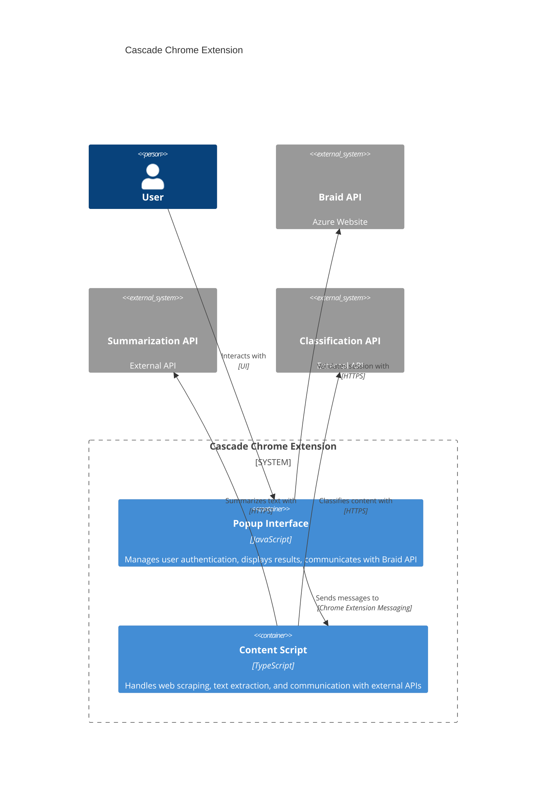

```mermaid
C4Context
title Cascade Chrome Extension

Person(user, "User")

System_Boundary(c4_extension, "Cascade Chrome Extension") {
  Container(popup, "Popup Interface", "JavaScript", "Manages user authentication, displays results, communicates with Braid API")
  Container(content_script, "Content Script", "TypeScript", "Handles web scraping, text extraction, and communication with external APIs")
}

System_Ext(braid_api, "Braid API", "Azure Website", "Session validation")
System_Ext(summarization_api, "Summarization API", "External API", "Text summarization")
System_Ext(classification_api, "Classification API", "External API", "Content classification")

Rel(user, popup, "Interacts with", "UI")
Rel(popup, braid_api, "Validates session with", "HTTPS")
Rel(popup, content_script, "Sends messages to", "Chrome Extension Messaging")
Rel(content_script, summarization_api, "Summarizes text with", "HTTPS")
Rel(content_script, classification_api, "Classifies content with", "HTTPS")

```
