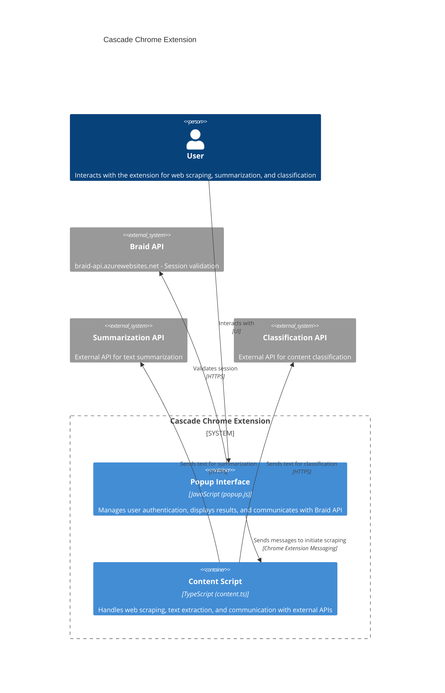

```mermaid
C4Context
title Cascade Chrome Extension

Person(user, "User", "Interacts with the extension for web scraping, summarization, and classification")

System_Ext(braid_api, "Braid API", "braid-api.azurewebsites.net - Session validation")
System_Ext(summarization_api, "Summarization API", "External API for text summarization")
System_Ext(classification_api, "Classification API", "External API for content classification")

System_Boundary(c4_context, "Cascade Chrome Extension") {
  Container(popup, "Popup Interface", "JavaScript (popup.js)", "Manages user authentication, displays results, and communicates with Braid API")
  Container(content_script, "Content Script", "TypeScript (content.ts)", "Handles web scraping, text extraction, and communication with external APIs")
}

Rel(user, popup, "Interacts with", "UI")
Rel(popup, braid_api, "Validates session", "HTTPS")
Rel(popup, content_script, "Sends messages to initiate scraping", "Chrome Extension Messaging")
Rel(content_script, summarization_api, "Sends text for summarization", "HTTPS")
Rel(content_script, classification_api, "Sends text for classification", "HTTPS")

```
