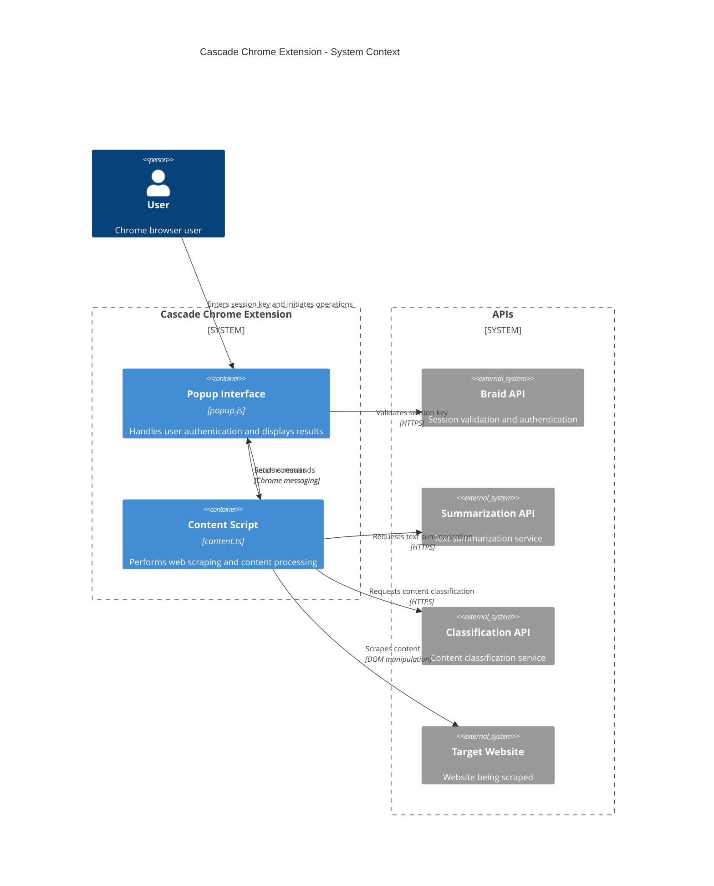

```mermaid
C4Context
title Cascade Chrome Extension - System Context

Person(user, "User", "Chrome browser user")

System_Boundary(cascade, "Cascade Chrome Extension") {
    Container(popup, "Popup Interface", "popup.js", "Handles user authentication and displays results")
    Container(content, "Content Script", "content.ts", "Performs web scraping and content processing")
}

System_Boundary(apis, "APIs") {
System_Ext(braidApi, "Braid API", "Session validation and authentication")
System_Ext(summarizeApi, "Summarization API", "Text summarization service")
System_Ext(classifyApi, "Classification API", "Content classification service")
System_Ext(targetWeb, "Target Website", "Website being scraped")
}

Rel(user, popup, "Enters session key and initiates operations")
Rel(popup, braidApi, "Validates session key", "HTTPS")
Rel(popup, content, "Sends commands", "Chrome messaging")
Rel(content, targetWeb, "Scrapes content", "DOM manipulation")
Rel(content, summarizeApi, "Requests text summarization", "HTTPS")
Rel(content, classifyApi, "Requests content classification", "HTTPS")
Rel(content, popup, "Returns results", "Chrome messaging")
```