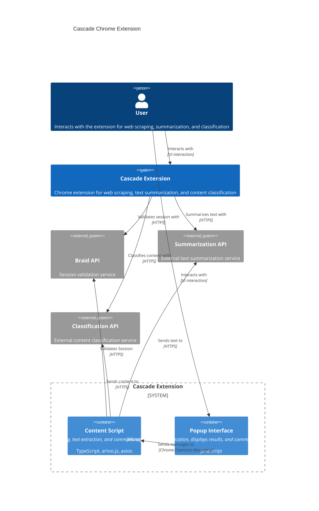

```mermaid
C4Context
title Cascade Chrome Extension

Person(user, "User", "Interacts with the extension for web scraping, summarization, and classification")

System(extension, "Cascade Extension", "Chrome extension for web scraping, text summarization, and content classification")

System_Ext(braid_api, "Braid API", "Session validation service", "braid-api.azurewebsites.net")
System_Ext(summarization_api, "Summarization API", "External text summarization service")
System_Ext(classification_api, "Classification API", "External content classification service")

Rel(user, extension, "Interacts with", "UI interaction")
Rel(extension, braid_api, "Validates session with", "HTTPS")
Rel(extension, summarization_api, "Summarizes text with", "HTTPS")
Rel(extension, classification_api, "Classifies content with", "HTTPS")

System_Boundary(extension_boundary, "Cascade Extension") {
  Container(content_script, "Content Script", "Handles web scraping, text extraction, and communication with external APIs", "TypeScript, artoo.js, axios")
  Container(popup_interface, "Popup Interface", "Manages user authentication, displays results, and communicates with Braid API", "JavaScript")

  Rel(user, popup_interface, "Interacts with", "UI interaction")
  Rel(popup_interface, content_script, "Sends messages to", "Chrome Extension Messaging")
  Rel(content_script, braid_api, "Validates Session", "HTTPS")
  Rel(content_script, summarization_api, "Sends text to", "HTTPS")
  Rel(content_script, classification_api, "Sends content to", "HTTPS")

}
```
