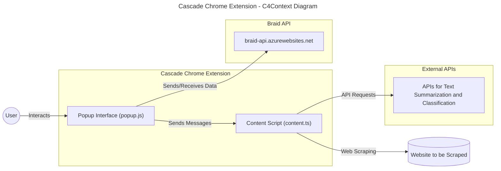

```mermaid
---
title: Cascade Chrome Extension - C4Context Diagram
---
flowchart LR
    User -->|Interacts| Popup_Interface
    Popup_Interface -->|Sends/Receives Data| Braid_API
    Popup_Interface -->|Sends Messages| Content_Script
    Content_Script -->|Web Scraping| Website
    Content_Script -->|API Requests| External_APIs
    
    subgraph Chrome_Extension ["Cascade Chrome Extension"]
        direction TB
        Popup_Interface["Popup Interface (popup.js)"]
        Content_Script["Content Script (content.ts)"]
    end
    
    subgraph Braid ["Braid API"]
        direction TB
        Braid_API["braid-api.azurewebsites.net"]
    end
    
    subgraph External ["External APIs"]
        direction TB
        External_APIs["APIs for Text Summarization and Classification"]
    end
    
    User((User))
    Website[("Website to be Scraped")]
```

