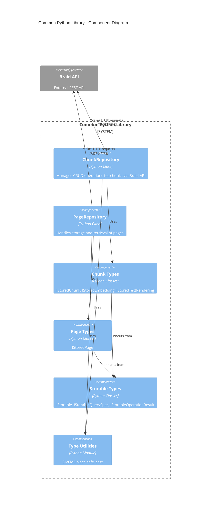

```mermaid
C4Component
title Common Python Library - Component Diagram

System_Boundary(common_py, "Common Python Library") {
    Component(chunk_repo, "ChunkRepository", "Python Class", "Manages CRUD operations for chunks via Braid API")
    Component(page_repo, "PageRepository", "Python Class", "Handles storage and retrieval of pages")
    
    Component(chunk_types, "Chunk Types", "Python Classes", "IStoredChunk, IStoredEmbedding, IStoredTextRendering")
    Component(page_types, "Page Types", "Python Classes", "IStoredPage")
    
    Component(storable_types, "Storable Types", "Python Classes", "IStorable, IStorableQuerySpec, IStorableOperationResult")
    Component(type_utils, "Type Utilities", "Python Module", "DictToObject, safe_cast")
}

System_Ext(braid_api, "Braid API", "External REST API")

Rel(chunk_repo, braid_api, "Makes HTTP requests", "REST/HTTPS")
Rel(page_repo, braid_api, "Makes HTTP requests", "REST/HTTPS")

Rel(chunk_repo, chunk_types, "Uses")
Rel(page_repo, page_types, "Uses")

Rel(chunk_types, storable_types, "Inherits from")
Rel(page_types, storable_types, "Inherits from")

Rel(chunk_repo, type_utils, "Uses")
Rel(page_repo, type_utils, "Uses")

UpdateLayoutConfig($c4ShapeInRow="3", $c4BoundaryInRow="1")
```