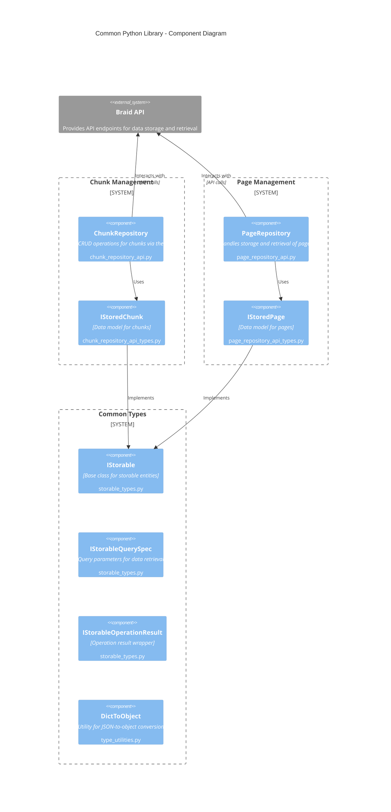

```mermaid
C4Component
title Common Python Library - Component Diagram

System_Boundary(chunk_management, "Chunk Management") {
    Component(chunk_repository, "ChunkRepository", "Manages CRUD operations for chunks via the Braid API", "chunk_repository_api.py")
    Component(stored_chunk, "IStoredChunk", "Data model for chunks", "chunk_repository_api_types.py")
}

System_Boundary(page_management, "Page Management") {
    Component(page_repository, "PageRepository", "Handles storage and retrieval of pages", "page_repository_api.py")
    Component(stored_page, "IStoredPage", "Data model for pages", "page_repository_api_types.py")
}

System_Boundary(common_types, "Common Types") {
    Component(storable, "IStorable", "Base class for storable entities", "storable_types.py")
    Component(storable_query_spec, "IStorableQuerySpec", "Query parameters for data retrieval", "storable_types.py")
    Component(storable_operation_result, "IStorableOperationResult", "Operation result wrapper", "storable_types.py")
    Component(dict_to_object, "DictToObject", "Utility for JSON-to-object conversion", "type_utilities.py")
}

System_Ext(braid_api, "Braid API", "Provides API endpoints for data storage and retrieval")

Rel(chunk_repository, braid_api, "Interacts with", "API calls")
Rel(page_repository, braid_api, "Interacts with", "API calls")
Rel(chunk_repository, stored_chunk, "Uses", "")
Rel(page_repository, stored_page, "Uses", "")
Rel(stored_chunk, storable, "Implements", "")
Rel(stored_page, storable, "Implements", "")

```

%% Generated by Salon from Braid Technologies, 28/02/2025
