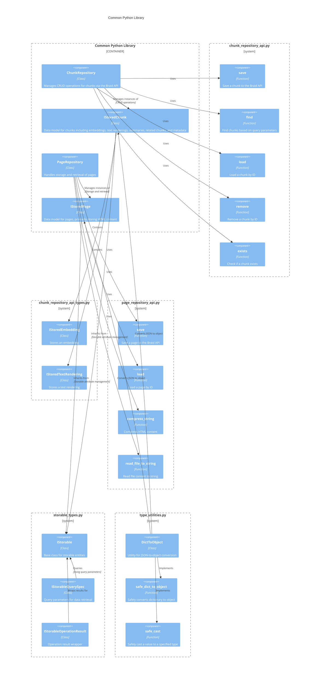

```mermaid
C4Component
  title Common Python Library

  Container_Boundary(lib, "Common Python Library") {
    Component(lib_chunk_repo, "ChunkRepository", "Class", "Manages CRUD operations for chunks via the Braid API")
    Component(lib_chunk_model, "IStoredChunk", "Class", "Data model for chunks including embeddings, text renderings, summaries, related chunks, and metadata")
    Component(lib_page_repo, "PageRepository", "Class", "Handles storage and retrieval of pages")
    Component(lib_page_model, "IStoredPage", "Class", "Data model for pages, primarily storing HTML content")
    Component(lib_storable, "IStorable", "Class", "Base class for storable entities")
    Component(lib_storable_query, "IStorableQuerySpec", "Class", "Query parameters for data retrieval")
    Component(lib_storable_result, "IStorableOperationResult", "Class", "Operation result wrapper")
    Component(lib_dict_to_obj, "DictToObject", "Class", "Utility for JSON-to-object conversion")
  }

  Rel(lib_chunk_repo, lib_chunk_model, "Manages instances of", "CRUD operations")
  Rel(lib_page_repo, lib_page_model, "Manages instances of", "Storage and retrieval")
  Rel(lib_chunk_model, lib_storable, "Inherits from", "Storable attribute management")
  Rel(lib_page_model, lib_storable, "Inherits from", "Storable attribute management")
  Rel(lib_storable_query, lib_storable, "Queries", "Using query parameters")
  Rel(lib_dict_to_obj, lib_chunk_model, "Converts JSON to object")
  Rel(lib_dict_to_obj, lib_page_model, "Converts JSON to object")
  Rel(lib_storable_result, lib_storable, "Wraps results for")
  
  Boundary(module_chunk_api, "chunk_repository_api.py") {
    Component(lib_chunk_repo_save, "save", "Function", "Save a chunk to the Braid API")
    Component(lib_chunk_repo_find, "find", "Function", "Find chunks based on query parameters")
    Component(lib_chunk_repo_load, "load", "Function", "Load a chunk by ID")
    Component(lib_chunk_repo_remove, "remove", "Function", "Remove a chunk by ID")
    Component(lib_chunk_repo_exists, "exists", "Function", "Check if a chunk exists")
  }

  Rel(lib_chunk_repo, lib_chunk_repo_save, "Uses")
  Rel(lib_chunk_repo, lib_chunk_repo_find, "Uses")
  Rel(lib_chunk_repo, lib_chunk_repo_load, "Uses")
  Rel(lib_chunk_repo, lib_chunk_repo_remove, "Uses")
  Rel(lib_chunk_repo, lib_chunk_repo_exists, "Uses")

  Boundary(module_chunk_api_types, "chunk_repository_api_types.py") {
    Component(lib_chunk_model_embedding, "IStoredEmbedding", "Class", "Stores an embedding")
    Component(lib_chunk_model_text, "IStoredTextRendering", "Class", "Stores a text rendering")
  }

  Rel(lib_chunk_model, lib_chunk_model_embedding, "Contains")
  Rel(lib_chunk_model, lib_chunk_model_text, "Contains")

  Boundary(module_page_api, "page_repository_api.py") {
    Component(lib_page_repo_save, "save", "Function", "Save a page to the Braid API")
    Component(lib_page_repo_load, "load", "Function", "Load a page by ID")
    Component(lib_page_compress, "compress_string", "Function", "Compress HTML content")
    Component(lib_page_read_file, "read_file_to_string", "Function", "Read file content to string")
  }

  Rel(lib_page_repo, lib_page_repo_save, "Uses")
  Rel(lib_page_repo, lib_page_repo_load, "Uses")
  Rel(lib_page_repo, lib_page_compress, "Uses")
  Rel(lib_page_repo, lib_page_read_file, "Uses")

  Boundary(module_storable_types, "storable_types.py") {
    Component(lib_storable, "IStorable", "Class", "Base class for storable entities")
    Component(lib_storable_query, "IStorableQuerySpec", "Class", "Query parameters for data retrieval")
    Component(lib_storable_result, "IStorableOperationResult", "Class", "Operation result wrapper")
  }

  Boundary(module_type_utils, "type_utilities.py") {
    Component(lib_dict_to_obj, "DictToObject", "Class", "Utility for JSON-to-object conversion")
    Component(lib_safe_dict_to_obj, "safe_dict_to_object", "Function", "Safely converts dictionary to object")
    Component(lib_safe_cast, "safe_cast", "Function", "Safely cast a value to a specified type")
  }

  Rel(lib_dict_to_obj, lib_safe_dict_to_obj, "Implements")
  Rel(lib_dict_to_obj, lib_safe_cast, "Implements")
```

This diagram breaks the libraries into their respective components, shows their relationships, and structures them within the respective files in the system.