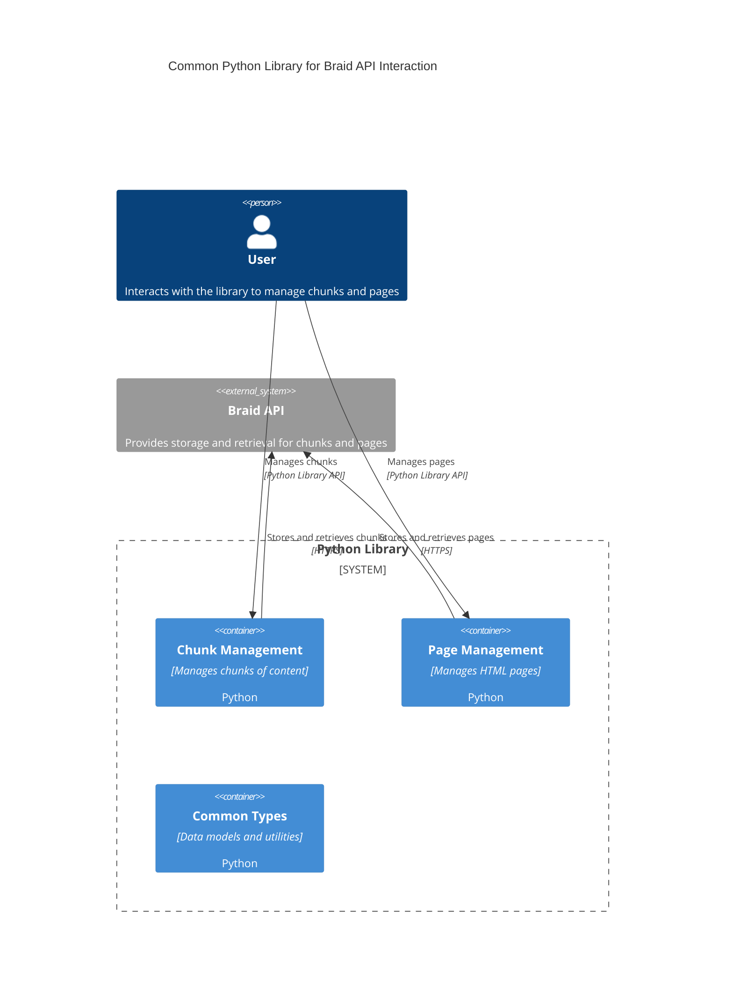

```mermaid
C4Context
title Common Python Library for Braid API Interaction

Person(user, "User", "Interacts with the library to manage chunks and pages")

System_Boundary(c1, "Python Library") {
  Container(chunk_management, "Chunk Management", "Manages chunks of content", "Python")
  Container(page_management, "Page Management", "Manages HTML pages", "Python")
  Container(common_types, "Common Types", "Data models and utilities", "Python")
}

System_Ext(braid_api, "Braid API", "Provides storage and retrieval for chunks and pages")

Rel(user, chunk_management, "Manages chunks", "Python Library API")
Rel(user, page_management, "Manages pages", "Python Library API")
Rel(chunk_management, braid_api, "Stores and retrieves chunks", "HTTPS")
Rel(page_management, braid_api, "Stores and retrieves pages", "HTTPS")

```
