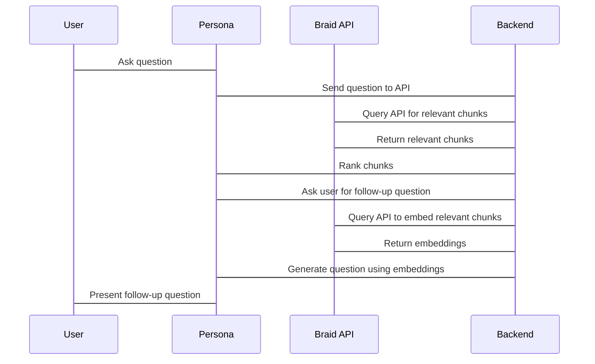

```mermaid
sequenceDiagram
participant User
participant Persona
participant Braid API
participant Backend

User->Persona: Ask question
Persona->Backend: Send question to API
Backend->Braid API: Query API for relevant chunks
Braid API->Backend: Return relevant chunks
Backend->Persona: Rank chunks
Persona->Backend: Ask user for follow-up question
Backend->Braid API: Query API to embed relevant chunks
Braid API->Backend: Return embeddings
Backend->Persona: Generate question using embeddings
Persona->User: Present follow-up question
```