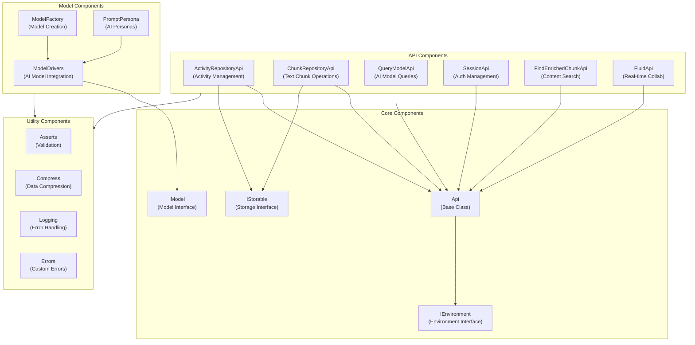

```mermaid
flowchart TB
    subgraph Core ["Core Components"]
        Api["Api\n(Base Class)"]
        IEnvironment["IEnvironment\n(Environment Interface)"]
        IStorable["IStorable\n(Storage Interface)"]
        IModel["IModel\n(Model Interface)"]
    end

    subgraph APIs ["API Components"]
        ActivityApi["ActivityRepositoryApi\n(Activity Management)"]
        ChunkApi["ChunkRepositoryApi\n(Text Chunk Operations)"]
        QueryApi["QueryModelApi\n(AI Model Queries)"]
        SessionApi["SessionApi\n(Auth Management)"]
        FindEnrichedApi["FindEnrichedChunkApi\n(Content Search)"]
        FluidApi["FluidApi\n(Real-time Collab)"]
    end

    subgraph Models ["Model Components"]
        ModelDriver["ModelDrivers\n(AI Model Integration)"]
        ModelFactory["ModelFactory\n(Model Creation)"]
        PromptPersona["PromptPersona\n(AI Personas)"]
    end

    subgraph Utils ["Utility Components"]
        Asserts["Asserts\n(Validation)"]
        Compress["Compress\n(Data Compression)"]
        Logging["Logging\n(Error Handling)"]
        Errors["Errors\n(Custom Errors)"]
    end

    %% Relationships
    Api --> IEnvironment
    ActivityApi --> Api
    ChunkApi --> Api
    QueryApi --> Api
    SessionApi --> Api
    FindEnrichedApi --> Api
    FluidApi --> Api

    ModelDriver --> IModel
    ModelFactory --> ModelDriver
    PromptPersona --> ModelDriver

    ActivityApi --> IStorable
    ChunkApi --> IStorable

    %% Utility Usage
    APIs --> Utils
    Models --> Utils

```