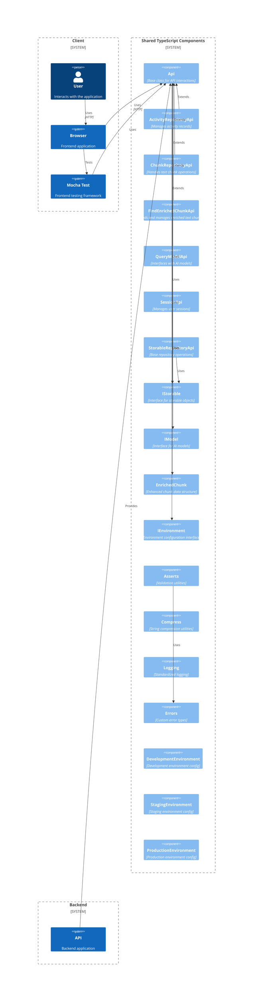

```mermaid
C4Context
  System_Boundary(c1, "Client") {
    Person(user, "User", "Interacts with the application")
    Rel(user, browser, "Uses", "HTTP")
    System(browser, "Browser", "Frontend application")
    Rel(browser, mocha, "Tests", "")
    System(mocha, "Mocha Test", "Frontend testing framework")


  }
  System_Boundary(c2, "Shared TypeScript Components") {
    Component(api, "Api", "Base class for API interactions")
    Component(activity_repo_api, "ActivityRepositoryApi", "Manages activity records")
    Component(chunk_repo_api, "ChunkRepositoryApi", "Handles text chunk operations")
    Component(find_enriched_chunk_api, "FindEnrichedChunkApi", "Finds and manages enriched text chunks")
    Component(query_model_api, "QueryModelApi", "Interfaces with AI models")
    Component(session_api, "SessionApi", "Manages user sessions")
    Component(storable_repo_api, "StorableRepositoryApi", "Base repository operations")

    Component(istorable, "IStorable", "Interface for storable objects")
    Component(imodel, "IModel", "Interface for AI models")
    Component(enriched_chunk, "EnrichedChunk", "Enhanced chunk data structure")
    Component(ienvironment, "IEnvironment", "Environment configuration interface")


    Component(asserts, "Asserts", "Validation utilities")
    Component(compress, "Compress", "String compression utilities")
    Component(logging, "Logging", "Standardized logging")
    Component(errors, "Errors", "Custom error types")


    Component(dev_env, "DevelopmentEnvironment", "Development environment config")
    Component(staging_env, "StagingEnvironment", "Staging environment config")
    Component(prod_env, "ProductionEnvironment", "Production environment config")


    Rel(activity_repo_api, api, "Extends", "")
    Rel(chunk_repo_api, api, "Extends", "")
    Rel(find_enriched_chunk_api, api, "Extends", "")
    Rel(query_model_api, api, "Extends", "")
    Rel(session_api, api, "Extends", "")


    Rel(activity_repo_api, istorable, "Uses", "")
    Rel(chunk_repo_api, istorable, "Uses", "")
    Rel(storable_repo_api, istorable, "Uses", "")
    Rel(query_model_api, imodel, "Uses", "")
    Rel(find_enriched_chunk_api, enriched_chunk, "Uses", "")


    Rel(api, ienvironment, "Uses", "")

    Rel(asserts, errors, "Uses", "")

  }

  System_Boundary(c3, "Backend") {
    System(api_server, "API", "Backend application")
  }

  Rel(browser, api, "Uses", "HTTP")
  Rel(mocha, api, "Uses", "")
  Rel(api_server, api, "Provides", "")


```
