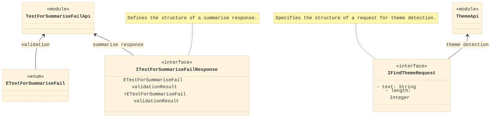

This class diagram illustrates the TypeScript components for two APIs: `TestForSummariseFailApi` and `ThemeApi`, along with their respective interfaces and enumerations. Here’s a description of the elements:

- `TestForSummariseFailApi` module contains logic related to summary failure tests.
- `ETestForSummariseFail` is an enumeration that could define various validation results.
- `ITestForSummariseFailResponse` is an interface that structures the response of a summary failure test, including a validation result of type `ETestForSummariseFail`.
- `ThemeApi` is a module associated with theme detection.
- `IFindThemeRequest` is an interface defining the structure for a theme detection request, with properties for `text` and `length`.
