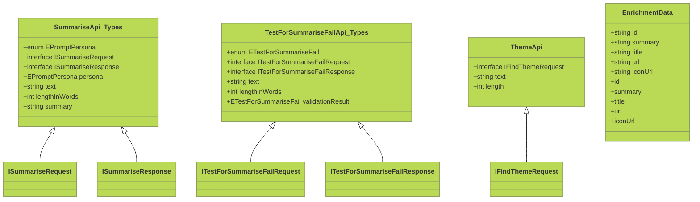

Sure, here is the Mermaid diagram for the system description you have provided:

```mermaid
C4Component
title Common TypeScript Components

System_Boundary(MainSystem, "Common TypeScript Components") {
    Container(Api, "Api", "TypeScript Class", "Base class for all API interactions")
    Container(ActivityRepositoryApi, "ActivityRepositoryApi", "TypeScript Class", "Manages activity records")
    Container(ChunkRepositoryApi, "ChunkRepositoryApi", "TypeScript Class", "Handles text chunk operations")
    Container(FindEnrichedChunkApi, "FindEnrichedChunkApi", "TypeScript Class", "Finds and manages enriched text chunks")
    Container(QueryModelApi, "QueryModelApi", "TypeScript Class", "Interfaces with AI models")
    Container(SessionApi, "SessionApi", "TypeScript Class", "Manages user sessions")
    Container(StorableRepositoryApi, "StorableRepositoryApi", "TypeScript Class", "Base repository operations for storable objects")
    Container_Data(IStorable, "IStorable", "TypeScript Interface", "Base interface for storable objects")
    Container_Data(IModel, "IModel", "TypeScript Interface", "Interface defining AI model capabilities")
    Container_Data(EnrichedChunk, "EnrichedChunk", "TypeScript Data Model", "Enhanced chunk data structures with embeddings")
    Container_Data(IEnvironment, "IEnvironment", "TypeScript Interface", "Environment configuration interface")
    Container(Asserts, "Asserts", "TypeScript Module", "Validation utilities")
    Container(Compress, "Compress", "TypeScript Module", "String compression/decompression utilities")
    Container(Logging, "Logging", "TypeScript Module", "Standardized logging functions")
    Container(Errors, "Errors", "TypeScript Module", "Custom error types")
    Container_Examples(EnvironmentManagement, "Environment Management", "TypeScript Classes", "") {
        Container(DevelopmentEnvironment, "DevelopmentEnvironment", "TypeScript Class", "Development environment configuration")
        Container(StagingEnvironment, "StagingEnvironment", "TypeScript Class", "Staging environment configuration")
        Container(ProductionEnvironment, "ProductionEnvironment", "TypeScript Class", "Production environment configuration")
    }
}

Rel(Asserts, Errors, "Uses")
Rel(ChunkRepositoryApi, Api, "Extends")
Rel(ActivityRepositoryApi, Api, "Extends")
Rel(FindEnrichedChunkApi, Api, "Extends")
Rel(QueryModelApi, Api, "Extends")
Rel(SessionApi, Api, "Extends")
Rel(StorableRepositoryApi, IStorable, "Implements")
Rel(Api, IEnvironment, "Uses")
Rel(Api, SessionApi, "Requires session authentication")
Rel(DevelopmentEnvironment, Logging, "Logs errors and info")
Rel(StagingEnvironment, Logging, "Logs errors and info")
Rel(ProductionEnvironment, Logging, "Logs errors and info")
```

Also, here's a class diagram for some related types in the system:



These diagrams highlight the structure and relationships of the common TypeScript components in the described system, showcasing how classes, interfaces and modules interrelate.

%% Generated by Salon from Braid Technologies, 09/03/2025
