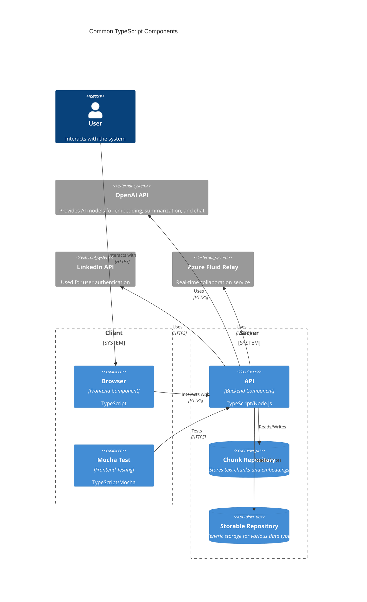

```mermaid
C4Context
title Common TypeScript Components

Person(User, "User", "Interacts with the system")

System_Boundary(c1, "Client") {
  Container(Browser, "Browser", "Frontend Component", "TypeScript")
  Container(MochaTest, "Mocha Test", "Frontend Testing", "TypeScript/Mocha")
}

System_Boundary(c2, "Server") {
    Container(API, "API", "Backend Component", "TypeScript/Node.js")
    ContainerDb(ChunkRepository, "Chunk Repository", "Stores text chunks and embeddings")
    ContainerDb(StorableRepository, "Storable Repository", "Generic storage for various data types")
}

System_Ext(OpenAI, "OpenAI API", "Provides AI models for embedding, summarization, and chat")
System_Ext(LinkedIn, "LinkedIn API", "Used for user authentication")
System_Ext(FluidRelay, "Azure Fluid Relay", "Real-time collaboration service")


Rel(User, Browser, "Interacts with", "HTTPS")
Rel(MochaTest, API, "Tests", "HTTPS")
Rel(Browser, API, "Interacts with", "HTTPS")
Rel(API, ChunkRepository, "Reads/Writes", "")
Rel(API, StorableRepository, "Reads/Writes", "")
Rel(API, OpenAI, "Uses", "HTTPS")
Rel(API, LinkedIn, "Uses", "HTTPS")
Rel(API, FluidRelay, "Uses", "HTTPS")

```
