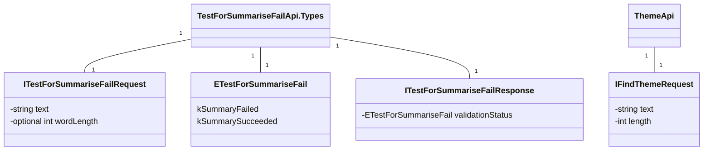

Sure, here is a mermaid diagram for the given software system explained:

Explanation:
- `TestForSummariseFailApi.Types` module contains the following entities:
  - `ITestForSummariseFailRequest`: Interface outlining the structure of a request object with properties `text` and optional `wordLength`.
  - `ETestForSummariseFail`: Enum with possible results such as `kSummaryFailed` and `kSummarySucceeded`.
  - `ITestForSummariseFailResponse`: Interface defining the structure of a response object with property `validationStatus`, which uses `ETestForSummariseFail` enum.

- `ThemeApi` module contains the `IFindThemeRequest` interface, which outlines the structure for theme detection requests with properties `text` and `length`.