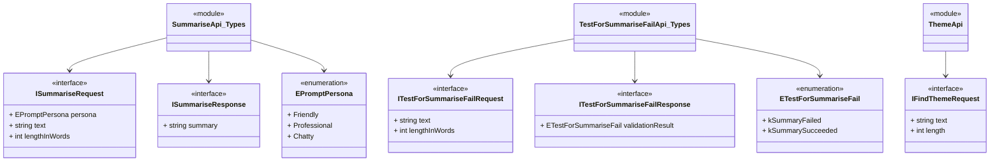

Here's the mermaid diagram for the described modules and their relationships:

This class diagram explains how different components interact:
1. `SummariseApi_Types` module contains the `ISummariseRequest` and `ISummariseResponse` interfaces and depends on the `EPromptPersona` enumeration.
2. `TestForSummariseFailApi_Types` module contains the `ITestForSummariseFailRequest`, `ITestForSummariseFailResponse` interfaces, and the `ETestForSummariseFail` enumeration.
3. `ThemeApi` module contains the `IFindThemeRequest` interface.

%% Generated by Salon from Braid Technologies, 09/03/2025
