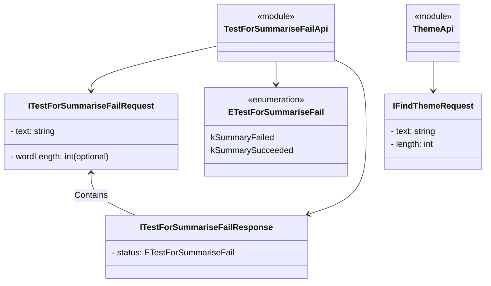

### Explanation:

1. **TestForSummariseFailApi Module:**

    - This module is depicted as a class containing references to multiple components:

        - **`ITestForSummariseFailRequest` Interface:**
            - This interface outlines the structure of the request used for testing summarization.
            - Properties:
                - `text`: A string representing the text.
                - `wordLength`: An optional integer specifying the word length.

        - **`ETestForSummariseFail` Enumeration:**
            - This enumeration contains possible results of the summarization test.
            - Values:
                - `kSummaryFailed`: Summarization failed.
                - `kSummarySucceeded`: Summarization succeeded.

        - **`ITestForSummariseFailResponse` Interface:**
            - This interface outlines the structure of the response received after testing summarization.
            - Properties:
                - `status`: An `ETestForSummariseFail` enumeration indicating the status of the summarization test.
                
2. **ThemeApi Module:**

    - This module is depicted as a class containing references to related components:

        - **`IFindThemeRequest` Interface:**
            - This interface outlines the structure of the request used for finding themes in the text.
            - Properties:
                - `text`: A string representing the text.
                - `length`: An integer specifying the length of the text considered for theme detection.

### Key Relationships:

- **TestForSummariseFailApi**:
    - Direct connections with `ITestForSummariseFailRequest`, `ETestForSummariseFail`, and `ITestForSummariseFailResponse`.

- **ThemeApi**:
    - Direct connection with `IFindThemeRequest`.

- **Dependency and Containment:**
    - `ITestForSummariseFailRequest` is connected with `ITestForSummariseFailResponse`, indicating a dependency where a response contains data based on the request.

### Usage:

- This diagram helps a new developer understand the various components involved in the `TestForSummariseFailApi` and `ThemeApi` modules, their structures, and how they interact with each other.