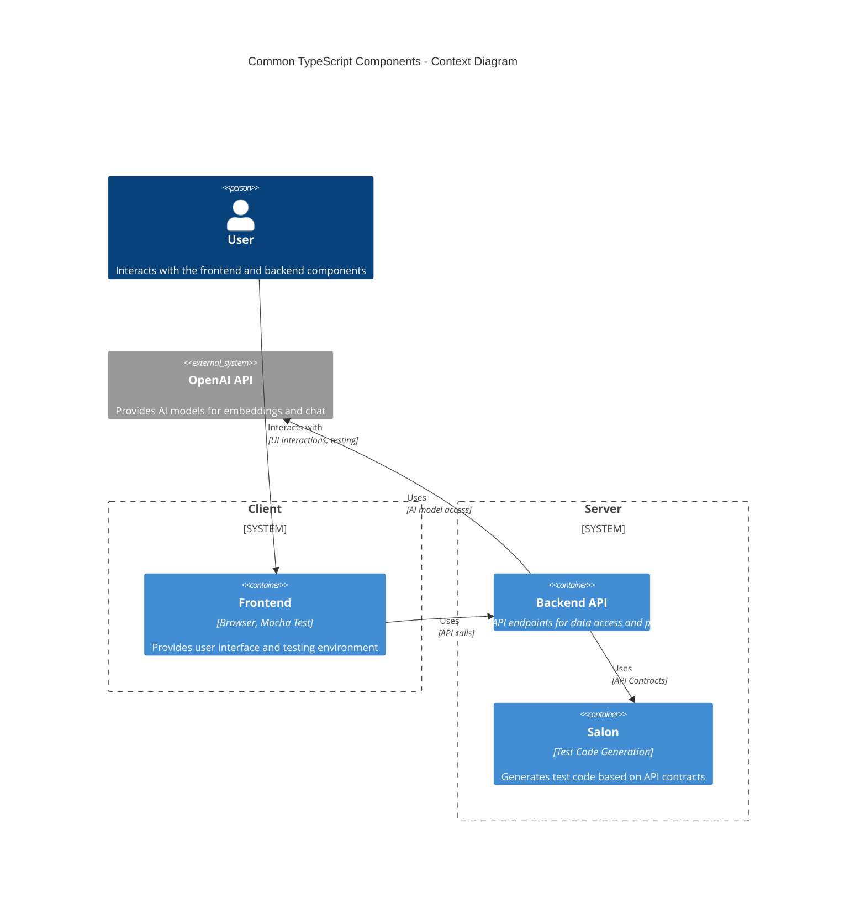

```mermaid
C4Context
title Common TypeScript Components - Context Diagram

Person(User, "User", "Interacts with the frontend and backend components")

System_Boundary(c1, "Client") {
  Container(Frontend, "Frontend", "Browser, Mocha Test", "Provides user interface and testing environment")
}

System_Boundary(c2, "Server") {
  Container(Backend, "Backend API", "Provides API endpoints for data access and processing")
  Rel(Backend, Salon, "Uses", "API Contracts")
  Container(Salon, "Salon", "Test Code Generation", "Generates test code based on API contracts")
}

System_Ext(OpenAI, "OpenAI API", "Provides AI models for embeddings and chat")

Rel(User, Frontend, "Interacts with", "UI interactions, testing")
Rel(Frontend, Backend, "Uses", "API calls")
Rel(Backend, OpenAI, "Uses", "AI model access")

```
