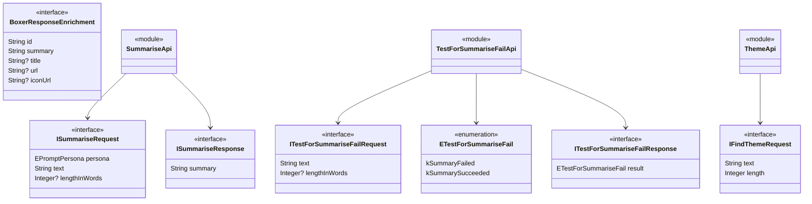

To create a detailed overview of the interaction and structure of the various modules and interfaces in the system, we'll use two diagrams: one that explains the overall system context and interactions, and another that dives into the class structure and relationships. 

Let's start with the context diagram that represents how a developer interacts with different modules and types within the system.

```mermaid
%%{init: {'theme': 'base', 'themeVariables': { 'primaryColor': '#ffffff', 'primaryBorderColor': '#000000', 'primaryTextColor': '#000000'}}}%%
C4Context
title Common TypeScript Components

Person(user, "Developer", "Developer using the Typescript components")

System_Boundary(api, "API Classes") {
    System(apiBase, "Api", "Base class for all API interactions, handling environment and session management")
    System(activityRepoApi, "ActivityRepositoryApi", "Manages activity records (save, remove, load, find, recent)")
    System(chunkRepoApi, "ChunkRepositoryApi", "Handles text chunk operations")
    System(findEnrichedChunkApi, "FindEnrichedChunkApi", "Finds and manages enriched text chunks")
    System(queryModelApi, "QueryModelApi", "Interfaces with AI models for queries and question generation")
    System(sessionApi, "SessionApi", "Manages user sessions")
    System(storableRepoApi, "StorableRepositoryApi", "Base repository operations for storable objects")
}

System_Boundary(dataModelsAndTypes, "Data Models & Types") {
    System(iStorable, "IStorable", "Base interface for all storable objects")
    System(iModel, "IModel", "Interface defining AI model capabilities")
    System(enrichedChunk, "EnrichedChunk", "Enhanced chunk data structures with embeddings")
    System(iEnvironment, "IEnvironment", "Environment configuration interface")
}

System_Boundary(utilities, "Utilities") {
    System(asserts, "Asserts", "Validation utilities")
    System(compress, "Compress", "String compression / decompression utilities")
    System(logging, "Logging", "Standardized logging functions")
    System(errors, "Errors", "Custom error types")
}

System_Boundary(envManagement, "Environment Management") {
    System(devEnv, "DevelopmentEnvironment")
    System(stagingEnv, "StagingEnvironment")
    System(prodEnv, "ProductionEnvironment")
}

Rel(user, api, "Uses")
Rel(user, dataModelsAndTypes, "Uses")
Rel(user, utilities, "Uses")
Rel(user, envManagement, "Uses")
```

Next, the detailed class diagram, showing how interfaces, types, and modules interact in the described system:



These diagrams should help new developers understand the overall structure and relationships within your system, providing clear context and detailed interaction among the components.

%% Generated by Salon from Braid Technologies, 09/03/2025
