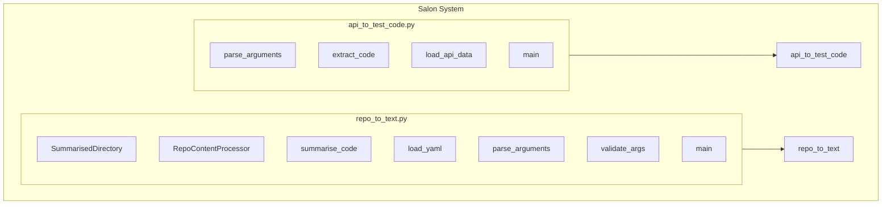

```mermaid
flowchart TB
    subgraph System_Boundary [Salon System]
        direction LR
        
        api_to_test_code[api_to_test_code]
        repo_to_text[repo_to_text]
        
        subgraph api_to_test_code_mod [api_to_test_code.py]
            parse_arguments
            extract_code
            load_api_data
            api_main[main]
        end
        
        subgraph repo_to_text_mod [repo_to_text.py]
            SummarisedDirectory
            RepoContentProcessor
            summarise_code
            load_yaml
            args_parse[parse_arguments]
            validate_args
            repo_main[main]
        end
        
        api_to_test_code_mod --> api_to_test_code
        repo_to_text_mod --> repo_to_text
    end
```