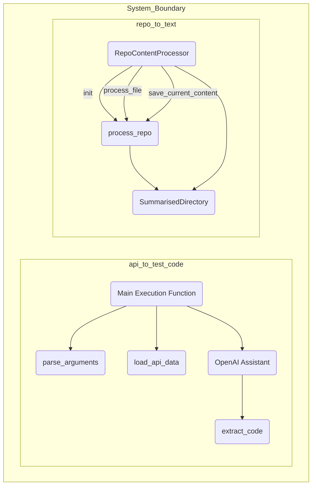

```mermaid
flowchart TB

subgraph System_Boundary
    subgraph api_to_test_code
        atc_main(Main Execution Function)
        atc_parse_arguments(parse_arguments)
        atc_extract_code(extract_code)
        atc_load_api_data(load_api_data)
        atc_generate_pytest_code(OpenAI Assistant)
        
        atc_main --> atc_parse_arguments
        atc_main --> atc_load_api_data
        atc_main --> atc_generate_pytest_code
        atc_generate_pytest_code --> atc_extract_code
    end

    subgraph repo_to_text
        rpt_main(process_repo)
        rpt_summarised_directory(SummarisedDirectory)
        rpt_repo_processor(RepoContentProcessor)
        
        rpt_repo_processor -->|init| rpt_main
        rpt_repo_processor -->|process_file| rpt_main
        rpt_repo_processor -->|save_current_content| rpt_main
        rpt_main --> rpt_summarised_directory
        
        rpt_repo_processor --> rpt_summarised_directory
    end
end
```