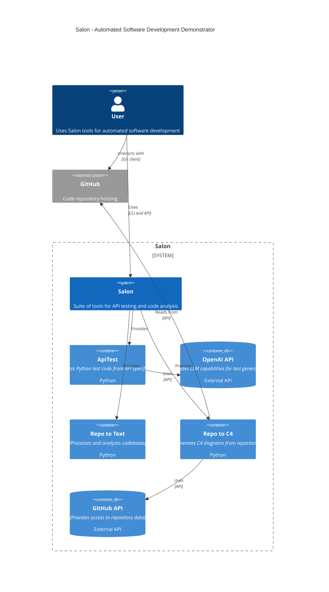

```mermaid
C4Context
title Salon - Automated Software Development Demonstrator

Person(user, "User", "Uses Salon tools for automated software development")

System_Boundary(c1, "Salon") {
  System(salon, "Salon", "Suite of tools for API testing and code analysis")
  Rel(user, salon, "Uses", "CLI and API")

  Container(apitest, "ApiTest", "Generates Python test code from API specifications", "Python")
  Rel(salon, apitest, "Provides", "")
  ContainerDb(openai_api, "OpenAI API", "Provides LLM capabilities for test generation", "External API")
  Rel(apitest, openai_api, "Uses", "API")

  Container(repo_to_text, "Repo to Text", "Processes and analyzes codebases", "Python")
  Rel(salon, repo_to_text, "Provides", "")

  Container(repo_to_c4, "Repo to C4", "Generates C4 diagrams from repositories", "Python")
  Rel(salon, repo_to_c4, "Provides", "")
  ContainerDb(github_api, "GitHub API", "Provides access to repository data", "External API")
  Rel(repo_to_c4, github_api, "Uses", "API")
}

System_Ext(github, "GitHub", "Code repository hosting")
Rel(user, github, "Interacts with", "Git client")
Rel(repo_to_c4, github, "Reads from", "API")
```
