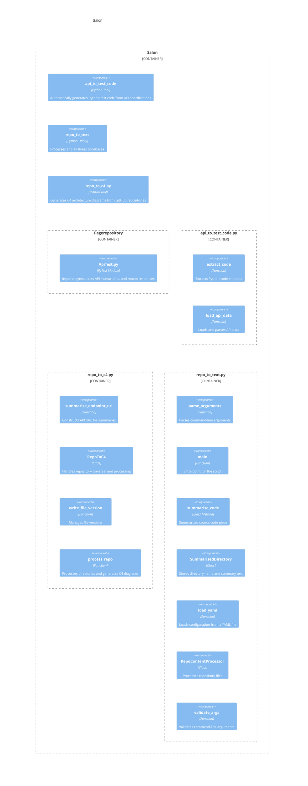

```mermaid
C4Component
title Salon

Container_Boundary(cb_Salon, "Salon") {
    Component(c_api_to_test_code, "api_to_test_code", "Python Tool", "Automatically generates Python test code from API specifications")
    Component(c_repo_to_text, "repo_to_text", "Python Utility", "Processes and analyzes codebases")
    Component(c_repo_to_c4, "repo_to_c4.py", "Python Tool", "Generates C4 architecture diagrams from GitHub repositories")

    Container_Boundary(cb_Pagerepository, "Pagerepository") {
        Component(c_ApiTest, "ApiTest.py", "PyTest Module", "Imports pytest, tests API interactions, and mocks responses")
    }

    Container_Boundary(cb_parser, "api_to_test_code.py") {
        Component(c_parse_arguments, "parse_arguments", "Function", "Parses command-line arguments")
        Component(c_extract_code, "extract_code", "Function", "Extracts Python code snippets")
        Component(c_load_api_data, "load_api_data", "Function", "Loads and parses API data")
        Component(c_main, "main", "Function", "Coordinates code generation process")
    }

    Container_Boundary(cb_repo_to_c4, "repo_to_c4.py") {
        Component(c_summarise_endpoint_url, "summarise_endpoint_url", "Function", "Constructs API URL for summaries")
        Component(c_summarise_code, "summarise_code", "Function", "Interacts with API to generate code summaries")
        Component(c_RepoToC4, "RepoToC4", "Class", "Handles repository traversal and processing")
        Component(c_write_file_version, "write_file_version", "Function", "Manages file versions")
        Component(c_process_repo, "process_repo", "Function", "Processes directories and generates C4 diagrams")
    }

    Container_Boundary(cb_repo_to_text, "repo_to_text.py") {
        Component(c_SummarisedDirectory, "SummarisedDirectory", "Class", "Stores directory name and summary text")
        Component(c_load_yaml, "load_yaml", "Function", "Loads configuration from a YAML file")
        Component(c_summarise_code, "summarise_code", "Class Method", "Summarizes source code piece")
        Component(c_RepoContentProcessor, "RepoContentProcessor", "Class", "Processes repository files")
        Component(c_parse_arguments, "parse_arguments", "Function", "Parses command-line arguments")
        Component(c_validate_args, "validate_args", "Function", "Validates command-line arguments")
        Component(c_main, "main", "Function", "Entry point for the script")
    }
}
```