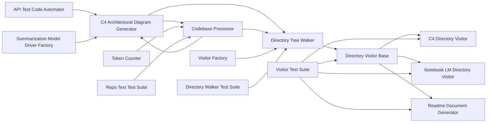

```mermaid
graph LR
  api_to_test_code["API Test Code Automator"] --> repo_to_c4["C4 Architectural Diagram Generator"]
  repo_to_text["Codebase Processor"] --> repo_to_c4["C4 Architectural Diagram Generator"]
  repo_to_c4["C4 Architectural Diagram Generator"]--> repo_to_text["Codebase Processor"]
  chat_model_drivers["Summarization Model Driver Factory"]--> repo_to_c4["C4 Architectural Diagram Generator"]
  count_tokens["Token Counter"] --> repo_to_text["Codebase Processor"]
  directory_visitor_base["Directory Visitor Base"] --> directory_visitor_c4["C4 Directory Visitor"]
  directory_visitor_base["Directory Visitor Base"] --> directory_visitor_notebook_lm["Notebook LM Directory Visitor"]
  directory_visitor_base["Directory Visitor Base"] --> directory_visitor_readme["Readme Document Generator"]
  directory_walker["Directory Tree Walker"] --> directory_visitor_base["Directory Visitor Base"]
  repo_to_c4["C4 Architectural Diagram Generator"] --> directory_walker["Directory Tree Walker"]
  repo_to_text["Codebase Processor"] --> directory_walker["Directory Tree Walker"]
  visitor_factory["Visitor Factory"] --> directory_walker["Directory Tree Walker"]
  test_repo_text["Repo Text Test Suite"] --> repo_to_text["Codebase Processor"]
  test_visitor["Visitor Test Suite"] --> directory_visitor_readme["Readme Document Generator"]
  test_visitor["Visitor Test Suite"] --> directory_visitor_notebook_lm["Notebook LM Directory Visitor"]
  test_visitor["Visitor Test Suite"] --> directory_visitor_c4["C4 Directory Visitor"]
  test_visitor["Visitor Test Suite"] --> directory_visitor_base["Directory Visitor Base"]
  test_walker["Directory Walker Test Suite"] --> directory_walker["Directory Tree Walker"]
```