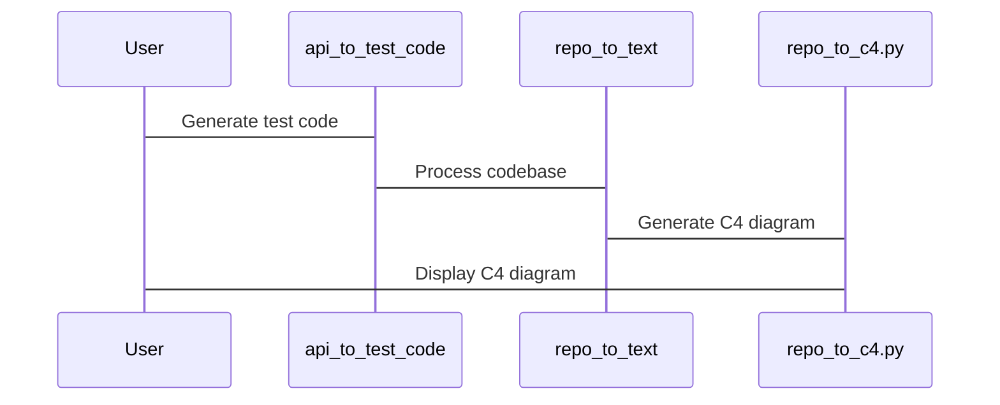

```mermaid
sequenceDiagram
participant User
participant api_to_test_code
participant repo_to_text
participant repo_to_c4.py

User->api_to_test_code: Generate test code
api_to_test_code->repo_to_text: Process codebase
repo_to_text->repo_to_c4.py: Generate C4 diagram
repo_to_c4.py->User: Display C4 diagram
```