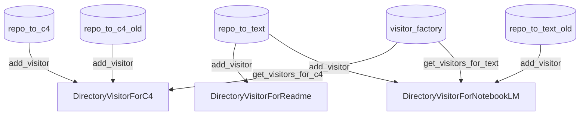

```mermaid
graph TD
  repo_to_c4[(repo_to_c4)]
  repo_to_text[(repo_to_text)]
  repo_to_c4_old[(repo_to_c4_old)]
  repo_to_text_old[(repo_to_text_old)]
  visitor_factory[(visitor_factory)]

  repo_to_c4 -- add_visitor --> DirectoryVisitorForC4
  repo_to_c4_old -- add_visitor --> DirectoryVisitorForC4
  repo_to_text -- add_visitor --> DirectoryVisitorForReadme
  repo_to_text -- add_visitor --> DirectoryVisitorForNotebookLM
  repo_to_text_old -- add_visitor --> DirectoryVisitorForNotebookLM

  visitor_factory-- get_visitors_for_c4 --> DirectoryVisitorForC4
  visitor_factory -- get_visitors_for_text --> DirectoryVisitorForNotebookLM
```