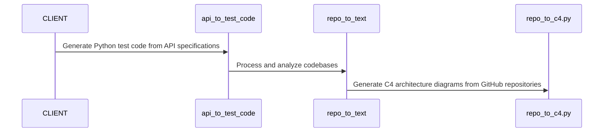

```mermaid
sequenceDiagram
participant CLIENT
participant api_to_test_code
participant repo_to_text
participant repo_to_c4.py
CLIENT ->> api_to_test_code: Generate Python test code from API specifications
api_to_test_code ->> repo_to_text: Process and analyze codebases
repo_to_text ->> repo_to_c4.py: Generate C4 architecture diagrams from GitHub repositories
```