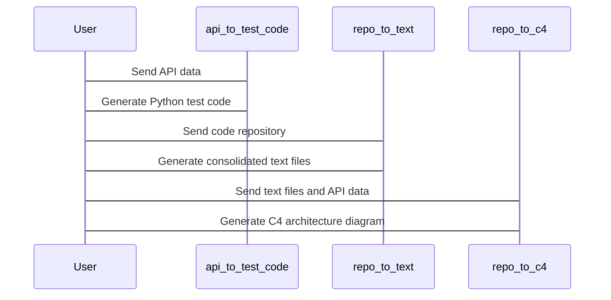

```mermaid
sequenceDiagram
participant User
participant api_to_test_code
participant repo_to_text
participant repo_to_c4
User->api_to_test_code: Send API data
api_to_test_code->User: Generate Python test code
User->repo_to_text: Send code repository
repo_to_text->User: Generate consolidated text files
User->repo_to_c4: Send text files and API data
repo_to_c4->User: Generate C4 architecture diagram
```