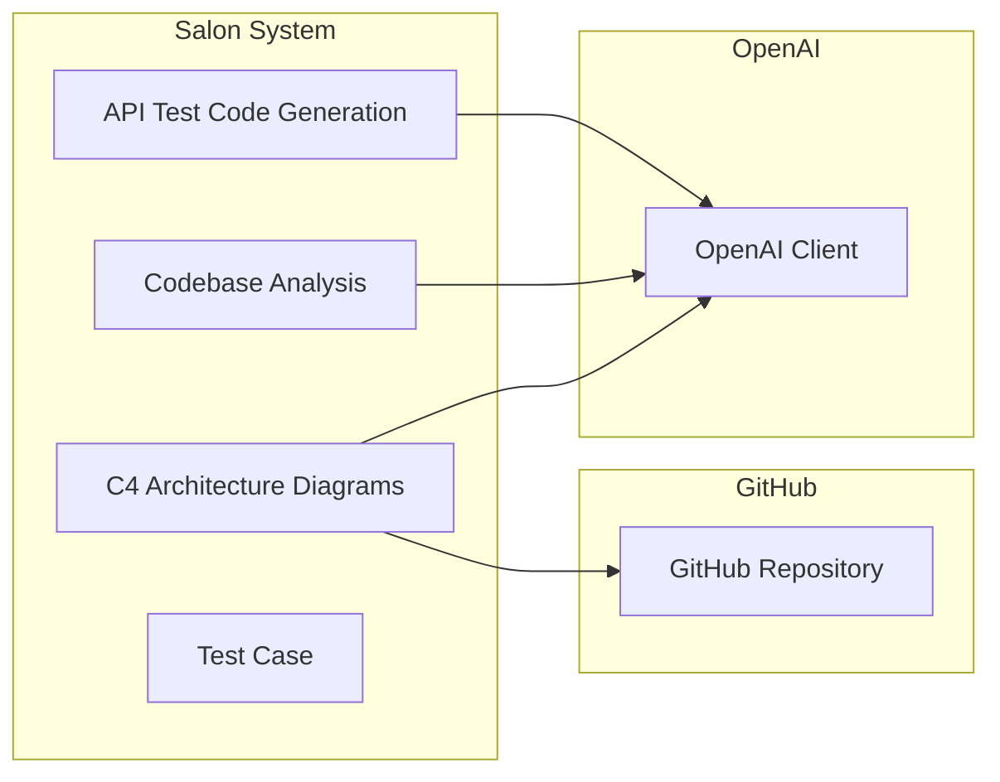

```mermaid
graph LR
  subgraph Salon System
    api_to_test_code["API Test Code Generation"]
    repo_to_text["Codebase Analysis"]
    repo_to_c4["C4 Architecture Diagrams"]
    PagerepositoryApi.Types_test.py["Test Case"]
  end
  subgraph OpenAI
    openai_client["OpenAI Client"]
  end
  subgraph GitHub
    github_repo["GitHub Repository"]
  end
  api_to_test_code --> openai_client
  repo_to_text --> openai_client
  repo_to_c4 --> openai_client
  repo_to_c4 --> github_repo
```